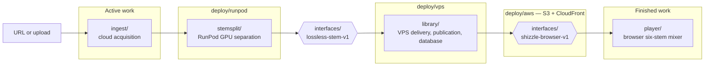
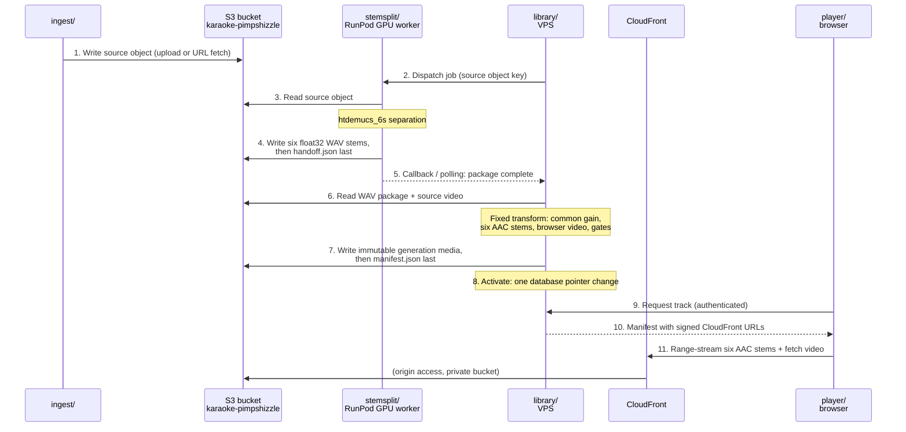
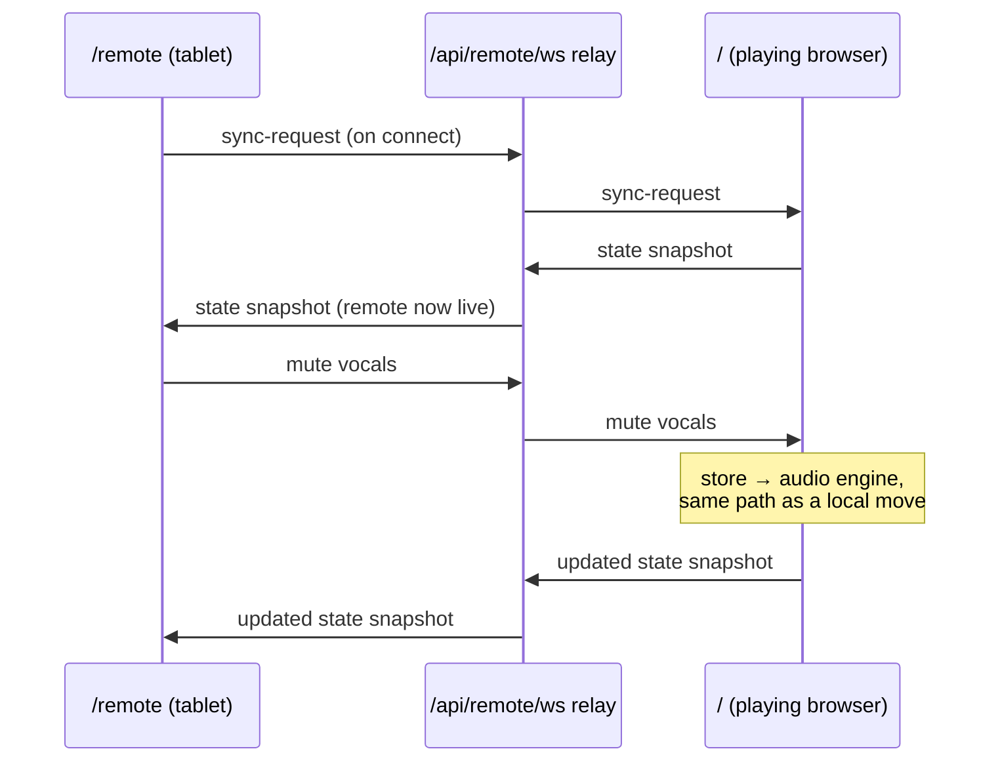

# Shizzle — Cloud Karaoke Stem Mixer

Shizzle turns a song into six independently mixable stems — vocals, drums,
bass, guitar, piano, and shizzle — and plays them from the cloud in a
standards-compliant browser. The public application is
`https://shizzle.systems`.

The repository is organized by pipeline function. Each top-level directory is
one stage a song moves through, and the contracts between stages live in
`interfaces/`. The system diagram and the file tree use the same names.

## System diagram



## Data flow

S3 is the hub. Every stage reads its input from the bucket and writes its
output back; no media ever moves machine-to-machine directly. The browser
never touches S3 — it streams through CloudFront, which fronts the same
bucket.



Steps 1–5 are the active work. Steps 6–8 are specified by
`shizzle-browser-v1` and proven manually, but the automated consumer is not
yet built. Steps 9–11 are finished and in production for 27 tracks.

## Current status

The downstream half — everything after `lossless-stem-v1` — is finished.

- The production library contains 27 accepted tracks.
- All 27 use audited immutable generations that satisfy `shizzle-browser-v1`.
- Playback, seeking, live mixing, synchronization, recovery, replay, direct
  health sensing, and cloud media delivery have been proven on the library.
- The runtime is entirely cloud-hosted and exposes one standards-based browser
  media path.

The active work is upstream: reliably turning a new URL or upload into a clean
`lossless-stem-v1` package using cloud infrastructure. Do not redesign or
revalidate the finished portion while doing this.

The honest current state of that upstream half:

- The upload dialog is a working front door to a room with no floor. The API
  accepts the file (2 GB cap, ffprobe gate, sha256), creates a job, and the
  UI polls it — but the orchestrator then routes to a Phase 2 local Demucs
  path, and the RunPod dispatch client is an explicit stub. On the CPU-only
  production VPS the job cannot complete.
- URL/YouTube ingestion is deliberately not implemented: the endpoint exists
  and fails immediately with a structured `YTDLP_BLOCKED` error. There is no
  URL field in the UI.
- The production database has zero jobs ever. All 27 library tracks arrived
  through import and migration scripts, not through ingestion.

## The two interfaces

Every stage boundary is a defined, versioned contract in `interfaces/`.

### `interfaces/lossless-stem-v1` — stem split hands off to the library

RunPod must hand the VPS exactly six aligned, lossless float32 WAV stems —
vocals, drums, bass, guitar, piano, and shizzle — plus `handoff.json`. Every
stem is stereo, 44.1 kHz, begins at sample zero, and has the same sample
count. There is no lossy encoding and no per-stem normalization. RunPod ends
at this interface; it does not choose browser codecs, bitrates, publication
layout, or playback behavior.

The sixth stem is named `shizzle` at this interface and everywhere after it.
The separator's native label for that output is `other`; the worker renames
it as it writes the package, so one name runs the entire pipeline from
handoff to browser (design authority, Mike 2026-08-11).

### `interfaces/shizzle-browser-v1` — the library hands off to the player

The VPS performs one fixed transformation on every accepted package: at most
one common attenuation, six stereo AAC-LC/M4A browser stems at a 256 kb/s
encoder target, browser-safe audio-less H.264 video, artifact verification,
immutable publication, and CloudFront delivery. Each complete generation must
remain at or below 2.5 Mb/s average. The accepted 27-track library measures
1.473–2.331 Mb/s.

## Repository layout

```text
shizzle/
├── interfaces/                  # The contracts. Schemas, examples, spec documents.
│   ├── lossless-stem-v1/        #   Stem split → library: schema, example, spec.
│   └── shizzle-browser-v1/      #   Library → player: delivery profile and gates.
├── ingest/                      # Cloud acquisition of a URL or upload. ACTIVE WORK.
├── stemsplit/                   # RunPod GPU worker: htdemucs_6s separation that
│                                #   emits exactly lossless-stem-v1. ACTIVE WORK.
├── library/                     # VPS control plane. Everything after the interface.
│   ├── api/                     #   FastAPI application and authenticated manifest.
│   ├── orchestrator/            #   Durable dispatch, callback, polling, retry.
│   ├── db/                      #   Postgres models, alembic migrations, pointers.
│   └── publish/                 #   Fixed delivery transformation: common gain,
│                                #     AAC encode, video, gates, immutable publication.
├── player/                      # Browser player and six-stem mixer (React/Vite).
├── deploy/                      # Where things run.
│   ├── vps/                     #   Hostinger VPS: compose.yml, Caddy.
│   ├── aws/                     #   Private S3 bucket and CloudFront distribution.
│   └── runpod/                  #   Endpoint template, GPU pool, image publishing.
├── ops/                         # Auditing, migration, and operational scripts.
├── docs/                        # Handoff, design, provenance, and incident notes.
└── evidence/                    # Frozen proofs behind the finished contracts.
    ├── cloud-continuous-playback/  # Encoding profile evidence and measurements.
    └── spikes/                     # Retained troubleshooting experiments.
```

## Module responsibilities

### `interfaces/`

Contracts only — JSON Schemas, complete examples, and the specification
documents. Nothing executable lives here. A change to a file in this
directory is a change to a system boundary and requires agreement from both
sides of that boundary.

### `ingest/`

Acquires source material entirely in cloud infrastructure. Direct upload is
the first-class entry and, for now, the only one: file drop in the UI,
chunked streaming to the server with a hard 2 GB cap, an ffprobe duration
gate, and a recorded source hash.

URL/YouTube acquisition comes later, as its own piece of work. The endpoint
is a deliberate stub today (`YTDLP_BLOCKED`). When built, it must run in
cloud infrastructure — provider bot controls are about network position, so
download success from a residential machine is misleading evidence and does
not prove the cloud path.

### `stemsplit/`

The RunPod serverless worker. It receives a cloud source object, runs
`htdemucs_6s`, writes six aligned float32 WAV stems without changing their
relative levels, uploads them, and writes `handoff.json` last. It stops at
the interface. Worker images are immutable, published only through the
dedicated GitHub Actions workflow, and referenced by tag in the RunPod
template.

Because the interface fixes the worker's entire deliverable, the worker's
role never changes after the current rewrite; later rebuilds are
maintenance or chosen upgrades, invisible downstream as long as the output
still satisfies `lossless-stem-v1`. The current code predates the interface
(salvaged from the k25 lineage) and still contains AAC encoding, video
derivation, and a multi-track mux; the rewrite deletes that obsolete half
rather than adding capability.

Worker requirements beyond the interface itself:

- The image is self-contained: `htdemucs_6s` weights are baked in at build
  time, and a separation must complete with no network egress except object
  storage. This is proven locally by running the container offline.
- Jobs are idempotent: the platform may redeliver a job after a worker
  dies, so a rerun must cleanly overwrite a predecessor's partial uploads.
  `handoff.json`-last already guarantees a partial attempt never crosses
  the interface.

The worker heartbeats every phase through the platform progress channel:
source download (bytes received), separation (segment N of M), WAV write,
and upload (parts completed). A job is never silently "in progress" — its
current phase and progress are always observable, so a stall is detectable
as a frozen heartbeat and diagnosable by which phase froze: never started
means platform or pool, frozen download means the S3 path, frozen
mid-segment means the GPU, frozen upload means egress.

### `library/`

The finished VPS control plane. The API serves the UI and the authenticated
manifest, rewriting object paths to expiring file-scoped CloudFront signed
URLs. The orchestrator owns dispatch, callback, polling, reconciliation,
retry, and publication.

The API also carries the remote-control relay at `/api/remote/ws`: a
stateless WebSocket fan-out, authenticated by the same device token
(cookie-borne, since browsers cannot set headers on WebSocket upgrades).
Every JSON frame from one client is repeated verbatim to every other; the
relay holds no mix state and interprets nothing.

The orchestrator is the single central monitor. Workers sense and report;
the orchestrator alone judges and acts. It records every worker heartbeat in
the job row as it polls, so a dead job's evidence lives in our database
rather than in the platform's log retention. Its watchdog triggers on
heartbeat age per phase — not total elapsed time — and on per-job expected
duration derived from the track length and measured baselines. The platform
execution timeout is kept only as a loose backstop behind it. The API
exposes the job records and heartbeat stream that feed the pipeline
dashboard in `player/`. The database stores tracks, jobs, and the single
active-generation pointer per track. Publication writes media first,
`manifest.json` last, and activates by one database pointer change; rollback
is a pointer change, never a media rewrite.

### `player/`

The browser player. Six AAC stems stream by Range request directly from the
edge; one bounded audio-less video is staged into a revocable browser Blob.
Playback health is sensed directly: media clocks, buffers, decoder state, Web
Audio state, per-stem PCM, master PCM, limiter state, and recovery, with
first-party telemetry.

The player serves three pages from one build, switched on path with no
router; Caddy's SPA fallback serves them all:

- `/` — the player itself, described above.
- `/remote` — a touch-sized control surface (phone or tablet): the full
  six-stem mixer, per-stem solo/mute, master volume, and the current track
  readout, with no video and no audio. It drives the playing browser through
  the relay. A remote is receive-only until it obtains the connection's
  first authoritative snapshot from the player, so a late joiner can never
  overwrite the live mix with stale state; commands it then sends are
  applied by the player through the same store path as local mixer moves.
- `/dashboard` — the pipeline board as a standalone page for a second
  screen; the same board is available inside the player as a drawer.



The player also carries the pipeline dashboard: the data-flow diagram above,
rendered live as the operator's panel. Each active job appears on the map at
the stage its last recorded heartbeat reported, with platform state on every
node — RunPod pool size and queue depth, orchestrator liveness, last storage
write, delivery health. Idle states are shown affirmatively ("pool at zero,
zero jobs in flight, idle as configured"), so a correctly quiet system is
distinguishable from a blind spot. Selecting a job opens its full recorded
history: every heartbeat, per-phase durations plotted against the measured
baselines, and — for a dead job — the stall-signature verdict in words. The
dashboard renders only first-party evidence: the orchestrator's job records
and the player's own sensing. It never proxies a provider status page.

### `deploy/`

- **vps** — Hostinger `72.60.173.171`, production files at
  `/opt/shizzle/prod`, compose project name `shizzle`, Caddy terminating
  HTTPS. Same-origin `/cdn` remains the tested delivery fallback.
- **aws** — private S3 bucket `karaoke-pimpshizzle` behind CloudFront
  distribution `ELKN8VGSX0M64` with origin access control and file-scoped
  24-hour signed URLs.
- **runpod** — endpoint `tevdw8022hs8hn`, bounded worker pool, allowed GPU
  pool, and the image publishing workflow. GitHub serves three needs here: a
  registry RunPod can pull from (GHCR), a linux/amd64 build machine with
  datacenter bandwidth for multi-gigabyte CUDA images, and provenance — each
  immutable tag ties to a commit, and `handoff.json` records which image ran
  each separation. The workflow currently lives in the separate
  `mdc159/shizzle-worker` repository; the reorg moves it into this one so
  the repo that holds the worker code also builds its image. All platform
  limits (disk, execution timeout, segment size, GPU pool) are set as
  measured local baseline plus margin, then trimmed from telemetry — never
  guessed.

### `ops/`

Operational tools that act on the library: full-library audits, delivery
migrations, quality measurement, and recorded one-off repairs. These scripts
are evidence-producing; their significant runs are recorded in `docs/`.

### `evidence/`

Read-only records that produced the finished contracts: the delivery encoding
profile, its full-library measurements, and the retained playback
troubleshooting spikes. This material explains why the contracts are what
they are; it is not current requirements.

## What to work on next

1. Build the local proving ground: MinIO standing in for S3, the worker
   container on the local GPU, and the VPS pipeline in local Docker. Iterate
   the complete flow — source in, `lossless-stem-v1` out, delivery transform,
   publication — until it is correct end to end. This includes an
   offline-worker run proving the image needs no runtime downloads, and a
   kill-the-worker-mid-job run proving a redelivered job cleanly overwrites
   partial uploads. Record wall-clock and resource baselines per track
   length; the local 8 GB GPU is the most constrained card involved, so
   everything proven on it carries at least 2x VRAM margin across the cloud
   pool. Every cloud limit (disk, timeout, segment size, GPU pool) is then
   set as measured baseline plus margin and trimmed from telemetry, never
   guessed. Only platform behavior — queue, cold start, callback
   reachability — is left for the cloud.
2. Change the stem-split worker to emit `lossless-stem-v1` exactly; remove
   AAC encoding, video derivation, and delivery-manifest ownership from the
   RunPod side.
3. Bake the `htdemucs_6s` weights into the worker image and publish a new
   immutable tag through the GitHub Actions workflow.
4. Point the RunPod template at the new tag and re-enable a small bounded
   worker pool.
5. Submit the golden fixture and require `COMPLETED` plus the exact lossless
   package in cloud storage. If it fails, collect the actual cloud worker
   logs before changing code.
6. Connect the orchestrator's dispatch, callback, polling, reconciliation,
   retry, and publication path.
7. Make URL acquisition cloud-reliable; keep upload as a first-class entry.
8. Feed `lossless-stem-v1` into the finished `shizzle-browser-v1` pipeline.
9. Build the pipeline dashboard in the player: the live data-flow map, the
   per-job heartbeat history, and affirmative idle states, all rendered from
   the orchestrator's first-party records.

## Current documentation

| Document | Purpose |
|---|---|
| [`docs/HANDOFF.md`](docs/HANDOFF.md) | Current live state and next upstream work |
| [`interfaces/lossless-stem-v1/spec.md`](interfaces/lossless-stem-v1/spec.md) | Exact stem-split output and library input contract |
| [`interfaces/shizzle-browser-v1/spec.md`](interfaces/shizzle-browser-v1/spec.md) | Finished browser-delivery profile and gates |
| [`docs/architecture.md`](docs/architecture.md) | Current architecture and workflow |
| [`evidence/cloud-continuous-playback/evidence.md`](evidence/cloud-continuous-playback/evidence.md) | Evidence that produced the finished profile |
| [`docs/playback-troubleshooting.md`](docs/playback-troubleshooting.md) | Symptom-driven diagnostics and retained experiments |

## Configuration and cautions

- Copy `.env.example` to `.env` and fill in the documented values. Never
  print or commit secrets; `secrets/`, `data/`, and `output/` are gitignored.
- On machines with a global `AWS_ENDPOINT_URL`, clear that value before
  accessing the production AWS account so commands do not silently target
  another S3-compatible service.
- Always use `docker compose -p shizzle`; an ambient compose project variable
  may otherwise select another stack.
- WAV never enters the browser library. The publisher and importer reject
  non-M4A or oversized stems.
