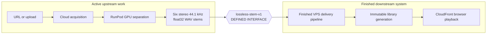

# Shizzle — Cloud Karaoke Stem Mixer

Shizzle turns a song into six independently mixable stems and plays them from
the cloud in a standards-compliant browser.

## Current status

The browser-delivery and playback portion is finished.

- The production library contains 27 accepted tracks.
- All 27 use audited immutable generations that satisfy `shizzle-browser-v1`.
- Playback, seeking, live mixing, synchronization, recovery, replay, direct
  health sensing, and cloud media delivery have been proven on the library.
- The runtime is entirely cloud-hosted and exposes one standards-based browser
  media path.

The remaining work is upstream ingestion: reliably turning a new URL or upload
into clean lossless six-stem material using cloud infrastructure.

## Defined RunPod-to-VPS interface



The interface is defined. RunPod must hand the VPS exactly six aligned,
lossless float32 WAV stems—vocals, drums, bass, guitar, piano, and other—plus
`handoff.json`. Every stem is stereo, 44.1 kHz, begins at sample zero, and has
the same sample count. There is no lossy encoding and no per-stem
normalization.

RunPod ends at that interface. The VPS begins there and performs one fixed
transformation: common attenuation when required, six AAC-LC/M4A browser
derivatives targeting 256 kb/s each, browser-safe video, artifact verification,
immutable publication, CloudFront delivery, and playback. The complete
generation must remain at or below 2.5 Mb/s average.

The accepted 27-track library proves complete-track delivery from 1.473 to
2.331 Mb/s average. The exact interface, measured bitrate envelope, file
layout, manifest, and responsibility split are in
[`docs/lossless-stem-handoff.md`](docs/lossless-stem-handoff.md).

## Finished delivery profile

- RunPod handoff: six stereo 44.1 kHz float32 WAV stems using
  `lossless-stem-v1`.
- Browser stems: six stereo M4A/AAC-LC files; every new lossless-derived encode
  uses a 44.1 kHz, 256 kb/s encoder target. Actual AAC average bitrate varies
  with the audio.
- Video: audio-less H.264/MP4, browser-safe profile, zero-based timestamps,
  short closed GOP, and fast-start metadata.
- Publication: immutable `tracks/<track-id>/<generation>/` objects, media first,
  `manifest.json` last, then one database pointer activation.
- Delivery: private S3 through signed CloudFront URLs; six stems stream by
  Range request and one bounded video is staged into a revocable browser Blob.
- Playback health: direct media clocks, buffers, decoder state, Web Audio state,
  per-stem PCM, master PCM, limiter state, recovery, and first-party telemetry.

The exact frozen profile and measurements are in
[`goals/cloud-continuous-playback/encoding-profile.md`](goals/cloud-continuous-playback/encoding-profile.md).

## What to work on next

1. Change the RunPod worker to emit `lossless-stem-v1` exactly.
2. Make that worker dependable on cloud GPU hardware.
3. Connect URL/upload ingestion to the worker.
4. Hand the package to the finished VPS delivery pipeline.

Do not redesign or revalidate the finished playback portion while doing this.

## Repository layout

```text
server/    FastAPI API, database, orchestration, publication, and telemetry
worker/    Cloud GPU separation and media preparation
ui/        Browser player and six-stem mixer
infra/     VPS, Caddy, and deployment configuration
scripts/   Auditing, migration, and operational tools
goals/     Finished playback profile and retained evidence
spikes/    Playback troubleshooting experiments and engineering evidence
docs/      Current design, handoff, provenance, and incident notes
```

## Current documentation

| Document | Purpose |
|---|---|
| [`docs/HANDOFF.md`](docs/HANDOFF.md) | Current live state and next upstream work |
| [`docs/lossless-stem-handoff.md`](docs/lossless-stem-handoff.md) | Exact RunPod output and VPS input interface |
| [`docs/superpowers/specs/2026-08-02-shizzle-cloud-karaoke-design.md`](docs/superpowers/specs/2026-08-02-shizzle-cloud-karaoke-design.md) | Current architecture and simple workflow |
| [`specs/shizzle-cloud-karaoke-implementation.html`](specs/shizzle-cloud-karaoke-implementation.html) | One-page visual implementation flow |
| [`goals/cloud-continuous-playback/encoding-profile.md`](goals/cloud-continuous-playback/encoding-profile.md) | Finished browser-delivery protocol |
| [`goals/cloud-continuous-playback/evidence.md`](goals/cloud-continuous-playback/evidence.md) | Evidence that produced the finished protocol |
| [`docs/playback-troubleshooting.md`](docs/playback-troubleshooting.md) | Targeted diagnostics and retained playback experiments |
| [`docs/library-source-purge-2026-08-05.md`](docs/library-source-purge-2026-08-05.md) | Documentation-only note about purged source material |

## Configuration

Copy `.env.example` to `.env` and fill in the documented values. Never print or
commit secrets. On machines with a global `AWS_ENDPOINT_URL`, clear that value
before accessing the production AWS account so commands do not silently target
another S3-compatible service.
