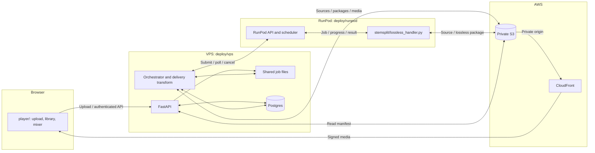

# Shizzle

Shizzle is a cloud karaoke player at <https://shizzle.systems>. Upload a video,
separate it on RunPod into six stems, then play and mix vocals, drums, bass,
guitar, piano, and shizzle in the browser. The VPS prepares and publishes
browser media; private S3 and CloudFront deliver it.

## Start here

- [Setup](docs/SETUP.md): prerequisites, local development, configuration, and production commissioning.
- [Architecture and swim lanes](docs/architecture.md): components, job transitions, playback, and remote control.
- [Testing](docs/TESTING.md): automated suites, stem-format experiments, listening, and continuous playback/scrubbing checks.
- [Playback troubleshooting](docs/playback-troubleshooting.md): instrumentation and retained experiments.
- [Deployment and rollback](docs/AUTOMATION.md): workflows, approvals, credentials, failure recovery.
- [Review results](docs/REVIEW.md): findings, GitHub issues, validation, and limits.
- [Invariants](docs/INVARIANTS.md): contracts and guarding tests.

## Implemented behavior

The upload API saves video on the VPS, records SHA-256 and metadata, and creates
a durable job. With `SHIZZLE_PIPELINE=cloud`, the orchestrator uploads the source
to S3, submits and polls RunPod, verifies the lossless package, derives browser
media, and publishes it. Dispatch reservations and worker-written S3 receipts
support recovery after interrupted requests. There is no completion webhook.

URL ingestion is not implemented: the API can create a URL job, but its
downloading stage fails with `YTDLP_BLOCKED`. The player offers file upload.
`ingest/` documents that boundary; executable ingestion lives in
`library/src/shizzle_server/api/routes.py` and `orchestrator/`.

Three pages share the passcode gate: `/` plays and mixes tracks, `/remote`
controls a playing browser, and `/dashboard` shows job stages and events.
The dashboard polls job records and API liveness; it does not query the RunPod
pool or show a measured capacity model.

## System diagram



The [swim lanes](docs/architecture.md#upload-to-publication) distinguish
control requests from media transfers and show completion markers.

## Media contracts

| Boundary | Contract |
|---|---|
| RunPod to VPS | [`lossless-stem-v1`](interfaces/lossless-stem-v1/spec.md): six aligned stereo 44.1 kHz float32 WAV files, hashes and provenance, `handoff.json` last. Separator role `other` becomes `shizzle`. |
| VPS to browser | [`shizzle-browser-v1`](interfaces/shizzle-browser-v1/spec.md): six AAC-LC/M4A stems, audio-less H.264 video, immutable generation, `manifest.json` last. New stems target 256 kb/s at 44.1 kHz; generation average is at most 2.5 Mb/s. |
| Playback | Six independent audio elements feed Web Audio gains and a master compressor. Each stem is synchronized to the video clock. After stem readiness, video is staged into one revocable Blob capped at 128 MiB. |

The lossless intake measures one common attenuation and records it as each
stem's default playback gain; it does not bake that gain into the AAC bytes.
Independent stem normalization changes the mix. Existing compatible AAC may be preserved without
lossy up-transcoding. Artifact checks and listening/playback checks serve
different purposes; both are covered in [Testing](docs/TESTING.md).

## Repository map

```text
library/
  src/shizzle_server/
    api/             FastAPI, auth, manifests, WebSocket relay
    db/              Models, leases, jobs, library and telemetry repositories
    orchestrator/    Source upload, RunPod dispatch/poll/recovery, stage loop
    publish/         Lossless intake, delivery profile, audits and publication
  alembic/           Schema migrations (0001 through 0005)
  tests/             Unit and real-Postgres contract tests
stemsplit/           Lossless worker and separately retained reference code
player/              React/TypeScript/Vite UI and Playwright suites
interfaces/          Versioned handoff and browser contracts
deploy/              VPS, RunPod and AWS operations and failure-path tests
ops/                 Audit, migration, metadata and review-sandbox tools
ingest/              Source-acquisition boundary documentation
docs/                Current setup, architecture, testing and operations
evidence/            Retained test procedures, scripts and measured results
fixtures/            Synthetic golden-30s.mp4 test source
goals/, templates/   PR review-convergence workflow assets
```

## Development and release

Follow [Setup](docs/SETUP.md#local-api-and-player) for a local API/UI without
cloud jobs. Production ingestion needs cloud configuration and a working lossless
RunPod endpoint; local/reference and fault-injection paths do not prove cloud
publication.

Run [Testing](docs/TESTING.md). Repository policy requires PRs, the `library`,
`stemsplit`, `player`, and `postgres-contract` checks, and review convergence.
A deployable master change queues production deployment behind an environment
approval; changes classified as docs-only skip deployment. Old evidence counts
are not proof that the currently deployed build passes.
