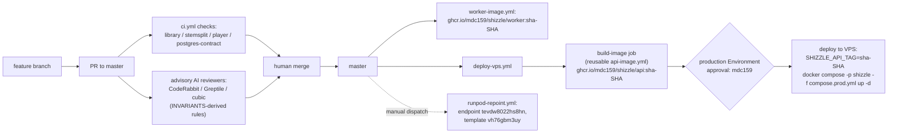

# Shizzle Automation

The review-and-deploy automation package: CI gates, image publishing, gated
VPS deploys, and how the three AI reviewers stay aligned on
[INVARIANTS.md](INVARIANTS.md). This document describes the target automation
state; workflow files live under `.github/workflows/`.

## 1. System overview



Every PR must pass the four `ci.yml` jobs (`library`, `stemsplit`, `player`,
`postgres-contract`) before merge; the AI reviewers are advisory and never
block. On merge to master, `worker-image.yml` publishes the GPU worker image
and `deploy-vps.yml` builds the api image (via reusable `api-image.yml`,
tagged `ghcr.io/mdc159/shizzle/api:sha-<sha>`) and deploys after an explicit
approval. `runpod-repoint.yml` is manual-only for fleet operations: it takes
an `image_tag` input, scales `workers_max` (default 0), and repoints endpoint
`tevdw8022hs8hn` at template `vh76gbm3uy`.

## 2. Secrets inventory

| Name | Scope | Grants | Rotation |
|------|-------|--------|----------|
| `VPS_SSH_KEY` | Environment `production` | SSH private key for the deploy user on the VPS host; deploy-vps uses it to run compose on the box | Generate new keypair, install in `~/.ssh/authorized_keys`, update the secret, remove old pubkey |
| `VPS_HOST` | Environment `production` | Hostname/IP the deploy targets | Update when the box moves |
| `VPS_SSH_HOST_KEY` | Environment `production` | Pinned ed25519 host key so deploy-vps verifies the box (no `StrictHostKeyChecking=no`) | Regenerate with `ssh-keyscan -t ed25519 <host>`; update after any host key change |
| `RUNPOD_API_KEY` | Repo | RunPod API access for `worker-image.yml` and `runpod-repoint.yml` (publish templates, repoint endpoints, scale workers) | Rotate in the RunPod console, update the repo secret |

Runtime secrets (passcode, `POSTGRES_*`, `AWS_*`, CloudFront private key) are
NOT GitHub secrets — they live only in the gitignored `.env` and mounted files
under `/opt/shizzle/prod` per invariant E3.

## 3. Deploy procedure

**On merge to master:**

1. `deploy-vps.yml` job `build-image` calls reusable `api-image.yml`, which
   builds and pushes `ghcr.io/mdc159/shizzle/api:sha-<sha>`.
2. Job `deploy` pauses at the GitHub Environment `production` gate until
   mdc159 approves. It fires on every master push and on manual dispatch.
3. After approval, the deploy SSHes to the VPS (using the pinned host key),
   sets `SHIZZLE_API_TAG=sha-<sha>` in `/opt/shizzle/prod/.env`, and runs
   `docker compose -p shizzle -f compose.prod.yml up -d`. The box pulls the
   image from GHCR — there is no source code on the VPS. The api container is
   the single schema writer and runs `alembic upgrade head` on start.

**Health checks after deploy** (see `deploy/vps/README.md`): public root,
authenticated API, database, orchestrator heartbeat, telemetry endpoint, and
CloudFront media Range behavior.

**Rollback:**

- Primary: re-run the previous green `deploy-vps` run. It pins the old sha it
  was built with, so re-running it is idempotent and restores the last known
  good image.
- Break-glass: edit `SHIZZLE_API_TAG` in `/opt/shizzle/prod/.env` to a known
  good sha and run `docker compose -p shizzle -f compose.prod.yml up -d` on
  the box.

**Local-build fallback:** when GHCR is unreachable or for one-off debugging,
the `compose.build.yml` overlay builds the api image on the box from a source
rsync instead of pulling the sha-pinned image. It is a fallback, not the
normal path — deploys never ship source to the box.

## 4. Reviewer alignment

All three reviewers consume the same source of truth:
[INVARIANTS.md](INVARIANTS.md).

- **CodeRabbit** — configured by [`.coderabbit.yaml`](../.coderabbit.yaml):
  `path_instructions` mirror the invariant series per area, and the
  `knowledge_base.code_guidelines` block makes CodeRabbit ingest
  `docs/INVARIANTS.md` directly, so reviews cite invariant IDs ("violates B3").
- **Greptile** — has no repo config file; its rules come from org-level custom
  context set via the Greptile API. The `path_instructions` texts from
  `.coderabbit.yaml` are mirrored there verbatim so both reviewers enforce the
  same invariants.
- **cubic** — configured through its dashboard custom rules. The six paste
  texts below are the standalone versions of the same path instructions; the
  owner pastes each into the dashboard.

## 5. cubic paste-text

One block per path scope; paste each into cubic's dashboard custom rules.

```text
Scope: stemsplit/**
RunPod GPU worker for the lossless-stem-v1 interface. Enforce handoff-last
ordering (A1): handoff.json must be uploaded only after every stem PUT has
returned — flag any code path that writes or renames it earlier. Every dispatch
attempt must write beneath its own immutable attempts/<sha256(idempotency_key)>
prefix (A6); older workers must never clobber newer receipts. Check S3
atomicity assumptions (A1, A10): every upload carries a locally computed
sha256, and the shared progress callback closure is mutated by several
transfer-manager threads, so every read-modify-write must hold its lock and
progress must stay monotonic (A11). Stems must stay pcm_f32le stereo 44100
with identical sample counts and no per-stem normalization (A3). The
flat-module layout (lossless_worker.py, s3_ops.py, etc. as siblings, no
package structure) is intentional for the worker image — do not suggest
packaging or directory reorganization.
```

```text
Scope: library/src/shizzle_server/orchestrator/**
Durable orchestrator stage loop. Enforce the B-series invariants from
docs/INVARIANTS.md: lease ownership must be checked inside the locked
transaction (B2), and the dispatch reservation must commit before any external
RunPod call (B3) — a timeout or 5xx must never trigger a second dispatch; it
reconciles the outstanding reservation instead. Poll-failure events dedupe to
one row per outage and any other event resets the window (B6). A failed RunPod
cancel must never mask the original error — _cancel_best_effort logs and
swallows (B7). Park frees the lease without consuming an attempt or appending
an event (B9). Every unresolvable error path fails closed (B5, B10) and every
stage handler must be idempotent under crash-rerun (B11). Heartbeats are
written only on phase change (B8); a RunPod job already marked failed
dispatches fresh under a new idempotency key (B12).
```

```text
Scope: library/src/shizzle_server/db/repository.py
Durable orchestrator stage loop. Enforce the B-series invariants from
docs/INVARIANTS.md: lease ownership must be checked inside the locked
transaction (B2), and the dispatch reservation must commit before any external
RunPod call (B3) — a timeout or 5xx must never trigger a second dispatch; it
reconciles the outstanding reservation instead. Poll-failure events dedupe to
one row per outage and any other event resets the window (B6). A failed RunPod
cancel must never mask the original error — _cancel_best_effort logs and
swallows (B7). Park frees the lease without consuming an attempt or appending
an event (B9). Every unresolvable error path fails closed (B5, B10) and every
stage handler must be idempotent under crash-rerun (B11). Heartbeats are
written only on phase change (B8); a RunPod job already marked failed
dispatches fresh under a new idempotency key (B12).
```

```text
Scope: library/src/shizzle_server/publish/**
Publication and delivery-profile policy. Enforce the C and D series from
docs/INVARIANTS.md: the manifest is the completion marker and is written last,
via server-side copy only (C2); published generations are immutable — an
existing destination manifest makes the publish a no-op (C1); the format guard
(m4a stems, 64 MiB cap, no raw PCM) must run before any promotion (C3); track
ids are deterministic uuid5 so reruns converge (C4); generation activation is
compare-and-swap with the ledger event in the same transaction (C5).
Duration/bitrate gates must reference the named constants in
delivery_profile.py (TRACK_DURATION_TOLERANCE_SEC 0.100,
STEM_DURATION_TOLERANCE_SEC 0.080, STEM_INTER_DURATION_TOLERANCE_SEC 0.005,
2.5 Mb/s cap) — flag any magic number or locally redefined tolerance (D1-D4).
delivery_profile.py must stay a pure policy module with no boto3/ffmpeg/db
imports (D7); at most one common attenuation, never per-stem and never a
boost (D3).
```

```text
Scope: library/alembic/**
Database migrations. Enforce the F series from docs/INVARIANTS.md: a single
linear chain with numeric filename prefix equal to the revision id and an
explicit down_revision (F1); additive-only changes unless the author
explicitly signs off on a destructive or rewriting migration — if you see a
drop/rewrite, ask for that sign-off in review. Every upgrade needs a paired,
real (non no-op) downgrade (F1). The DSN comes from DATABASE_URL and
target_metadata is Base.metadata (F2). Only the api container ever runs
alembic upgrade head (F3); the migration itself is under test via the contract
suite's real `alembic upgrade head` subprocess (F4) — flag any test fixture
that uses create_all.
```

```text
Scope: .github/workflows/**
CI/CD workflows. Image tags must be sha-pinned
(ghcr.io/mdc159/shizzle/api:sha-<sha> or worker:sha-<sha>) — flag any
latest/vN tag or hand-pushed image. Every workflow needs least-privilege
permissions and a concurrency group. No secret echoing in any step, and no
StrictHostKeyChecking=no anywhere — the deploy pins the host key via
VPS_SSH_HOST_KEY. deploy-vps deploys only after the production environment
approval gate; check that gate isn't bypassed.
```

```text
Scope: player/**
Browser player. Light review: correctness and obvious accessibility issues
only. No styling bikeshed — do not comment on CSS preferences, formatting, or
component organization. Flag real bugs (state races, broken playback logic,
unhandled errors) and clear WCAG violations (missing labels, keyboard traps,
contrast only when egregious).
```

## 6. Deferred hardening

Not in CI today, by choice:

- **knip** (`player/knip.json` exists) and **Playwright** (`player/e2e`,
  `player/playwright.config.ts` exist) do not run in `ci.yml`. The player job
  builds and lints only. Adding them is a follow-up, not a gap in this
  package.
- **library mypy is informational** — `continue-on-error: true` on a 23-error
  strict-mode baseline (recorded in PR #1). Fixing the debt and turning the
  gate hard is the typing-debt follow-up.
- **Unguarded invariants want tests**: E2 (`source_ref` never exposed in API
  responses) and A7 (uploaded handoff has `_`-prefixed private keys stripped)
  have no asserting test — see INVARIANTS.md for the wanted-test notes.

## 7. Lift to a new repo (template checklist)

Files to copy: `.coderabbit.yaml`, the `docs/INVARIANTS.md` skeleton (keep the
ID scheme and format; replace content), `docs/AUTOMATION.md`, and the four
workflow patterns (`ci.yml` multi-job checks, reusable `api-image.yml`,
gated `deploy-vps.yml`, `worker-image.yml`, plus `runpod-repoint.yml` if the
new repo has a serverless GPU fleet).

Names to substitute everywhere they appear (workflows, AUTOMATION.md,
.coderabbit.yaml):

- Image paths: `ghcr.io/<owner>/<repo>/api` and `.../worker`
- VPS host + production directory + domain
- RunPod endpoint id (was `tevdw8022hs8hn`) and template id (was
  `vh76gbm3uy`)
- Compose image-selection var (was `SHIZZLE_API_TAG`)

Settings sequence (order matters):

1. **Create the GitHub Environment `production` with its required reviewer
   BEFORE the first master merge.** The environment auto-creation trap: the
   first workflow run that references an environment creates it with no
   protection rules, so an ungated deploy slips through if you rely on
   auto-creation.
2. Add secrets to the environment (`VPS_SSH_KEY`, `VPS_HOST`,
   `VPS_SSH_HOST_KEY` — pinned via `ssh-keyscan -t ed25519 <host>`) and to the
   repo (`RUNPOD_API_KEY`). Install the reviewer apps and paste their rules
   (AUTOMATION.md §5) BEFORE the first PR so advisory review exists from PR #1.
3. Enable branch protection on master after the first CI run has produced the
   check names — require PRs and the actual job ids (`library`, `stemsplit`,
   `player`, `postgres-contract`); AI reviewers stay advisory, never required.
4. **After the first image push, flip the GHCR package to public visibility.**
   The private-package trap: the first push creates the package private by
   default and the VPS `docker compose pull` fails auth until visibility is
   changed (or a pull token is wired into the box).

Bootstrap order: environment + reviewer setup → secrets → first merge
(exercises build + gated deploy + package creation) → package visibility →
branch protection. This order means the approval gate exists before any
deploy can run, the pull works before anyone depends on it, and branch
protection references real check names.
