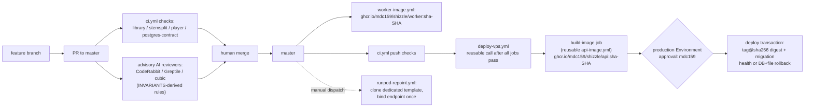

# Shizzle Automation

The review-and-deploy automation package: CI gates, image publishing, gated
VPS deploys, and how the three AI reviewers stay aligned on
[INVARIANTS.md](INVARIANTS.md). This document describes the target automation
state; workflow files live under `.github/workflows/`.

## 1. System overview



Every PR must pass the four `ci.yml` jobs (`library`, `stemsplit`, `player`,
`postgres-contract`) before merge; the AI reviewers are advisory and never
block. On merge to master, `worker-image.yml` publishes the GPU worker image
and the successful master CI workflow calls `deploy-vps.yml`. The reusable
`api-image.yml` publishes `ghcr.io/mdc159/shizzle/api:sha-<sha>` and passes its
registry digest to the environment-gated deploy. `runpod-repoint.yml` is
manual-only: it clones the endpoint's current template with the new image and
sets the new template plus `workers_max` in one endpoint update. The prior
template remains available for explicit rollback. Once an endpoint update has
been attempted, a failed or stale reconciliation preserves the new template;
automatic deletion is unsafe because the update may have committed despite a
lost response.

## 2. Secrets inventory

| Name | Scope | Grants | Rotation |
|------|-------|--------|----------|
| `VPS_SSH_KEY` | Environment `production` | SSH private key for the deploy user on the VPS host; deploy-vps uses it to run compose on the box | Generate new keypair, install in `~/.ssh/authorized_keys`, update the secret, remove old pubkey |
| `VPS_HOST` | Environment `production` | Hostname/IP the deploy targets | Update when the box moves |
| `VPS_SSH_HOST_KEY` | Environment `production` | Pinned ed25519 host key so deploy-vps verifies the box (no `StrictHostKeyChecking=no`) | Regenerate with `ssh-keyscan -t ed25519 <host>`; update after any host key change |
| `RUNPOD_API_KEY` | Repo | RunPod API access for `worker-image.yml` and `runpod-repoint.yml` (publish templates, repoint endpoints, scale workers) | Rotate in the RunPod console, update the repo secret |

Runtime secrets (passcode, `POSTGRES_*`, `AWS_*`, CloudFront private key) are
NOT GitHub secrets — they live only in the gitignored `.env` and mounted files
under `/opt/shizzle/prod` per invariant E3. The orchestrator defaults to
`SHIZZLE_PIPELINE=cloud`; with `RUNPOD_API_KEY` and `RUNPOD_ENDPOINT_ID` unset
the stack runs in the valid parked-cloud state — the orchestrator starts and
its heartbeat keeps /api/health green, and new jobs fail closed at dispatch
with `RUNPOD_DISPATCH_FAILED`. A job already dispatched to RunPod when
credentials disappear parks instead: its polls fail retryable and the stall
watchdog does not fire while the client is unconfigured, so the live remote
job reconciles on the first poll after credentials return. Set both
variables in the production `.env` when the RunPod path is connected.

## 3. Deploy procedure

**On merge to master:**

0. The `deploy-gate` job classifies the merge by diffing it against its
   parent. If every changed file is documentation (`docs/`, `evidence/`,
   `goals/`, `.agents/`, or any `*.md`), the deploy chain is skipped —
   nothing a docs-only merge ships would differ, so building an image and
   queuing an approval for it is pure waste (Mike, 2026-08-17). The gate
   fails open: a missing parent or empty diff deploys.
1. After all four jobs pass on a `master` push, `ci.yml` calls
   `deploy-vps.yml`; pull-request and non-master runs cannot call it. The called
   workflow rechecks the supplied SHA against current `master`. Job
   `build-image` calls reusable `api-image.yml`, which builds and pushes the
   SHA tag and exposes its registry digest.
2. Job `deploy` pauses at the GitHub Environment `production` gate until
   mdc159 approves. The workflow rechecks that `master` still names the same
   reviewed SHA after approval.
3. After approval, the deploy SSHes to the VPS (using the pinned host key),
   records the prior files and database revision, sets
   `SHIZZLE_API_IMAGE=<tag>@<digest>`, validates the staged Compose config,
   runs `alembic upgrade head` explicitly from the new api image, and starts
   the services. The box receives no source code.

**Health checks after deploy** — the deploy-vps.yml `Check production health`
step asserts, retrying up to 12 times at 10 s intervals until all pass: the
public root request succeeds, `/api/health` passes a jq assertion
(`status=="ok"`, `db==true`, `orchestratorAlive==true`), and `/cdn/tracks/x`
returns exactly 403 (media requires auth). The broader manual verifications
in `deploy/vps/README.md` (telemetry endpoint, CloudFront media Range
behavior) are NOT asserted by the workflow.

**Rollback:**

- Automatic: a deploy or health failure downgrades Alembic to the recorded
  prior revision before restoring the complete prior file snapshot and image
  identity. A real downgrade is mandatory under F1. If the downgrade itself
  fails, rollback still restores the prior files but leaves API and
  orchestrator stopped and returns the original downgrade failure for manual
  recovery; it never starts an old image against an unknown schema state. A
  failed application stop likewise restores the files, skips downgrade and
  restart, and returns the stop failure because schema mutation is unsafe while
  the new application may still be running.
- Break-glass: edit `SHIZZLE_API_IMAGE` in `/opt/shizzle/prod/.env` to a known
  tag-plus-digest reference and run Compose on the box. Automated deployment
  refuses an installation with no prior API identity; bootstrap the first
  release explicitly.

**Local-build fallback:** when GHCR is unreachable or for one-off debugging,
the `compose.build.yml` overlay builds the api image on the box from a source
copy instead of pulling the digest-pinned image. Set
`SHIZZLE_API_IMAGE=shizzle-api:local-build`; the overlay points both api and
orchestrator at that one build. It is a fallback, not the
normal path — deploys never ship source to the box.

## 4. Reviewer alignment

All three reviewers consume the same source of truth:
[INVARIANTS.md](INVARIANTS.md).

- **CodeRabbit** — configured by [`.coderabbit.yaml`](../.coderabbit.yaml):
  `path_instructions` mirror the invariant series per area, and the
  `knowledge_base.code_guidelines` block makes CodeRabbit ingest
  `docs/INVARIANTS.md` directly, so reviews cite invariant IDs ("violates B3").
- **Greptile** — the primary whole-diff validator. `.greptile/config.json`
  limits it to logic/syntax findings, points it at repository context, and
  disables review-on-every-push. `.greptile/files.json` supplies this document
  and `INVARIANTS.md` as canonical context. Trigger the final review manually
  only after a coherent candidate passes CI and failure-path validation.
- **cubic** — configured through its dashboard custom rules. The seven paste
  texts below are the standalone versions of the same path instructions; the
  owner pastes each into the dashboard.

### Coordinated review policy

- CodeRabbit is a free-plan advisory intake reviewer. It reviews the initial PR
  when quota is available; automatic incremental review is disabled. Never wait
  for quota or require a final-head CodeRabbit run.
- Cubic is advisory. Consume available P0/P1 findings, but do not wait for its
  completion or restart the loop for P2 polish.
- Greptile is primary. After batching all validated intake findings and passing
  required CI, manually trigger one final whole-diff review. Target confidence
  5/5. Confidence 4/5 is acceptable only when there are no reproduced P0/P1
  findings and every P2 has an explicit disposition. A score of 3/5 or lower,
  or Greptile's explicit do-not-merge recommendation, is not ready.
- Allow at most two repair batches. If a reproduced P0/P1 remains after the
  confirmation review, stop for human adjudication instead of greplooping.
- Reviewer findings are deduplicated into one ledger and fixed in batches. The
  coordinator owns readiness; reviewers provide evidence and never command one
  another.

## 5. cubic paste-text

One block per path scope; paste each into cubic's dashboard custom rules.

```text
Scope: stemsplit/**
RunPod GPU worker for the lossless-stem-v1 interface. Enforce handoff-last
ordering (A1): handoff.json must be uploaded only after every stem PUT has
returned — flag any code path that writes or renames it earlier. Every dispatch
attempt must write beneath its own immutable attempts/<sha256(idempotency_key)>
prefix (A6); older workers must never clobber newer receipts. Check S3
atomicity assumptions (A1, A10): every upload carries a locally computed
sha256, and the shared progress callback closure is mutated by several
transfer-manager threads, so every read-modify-write must hold its lock and
progress must stay monotonic (A11). Stems must stay pcm_f32le stereo 44100
with identical sample counts and no per-stem normalization (A3). The
flat-module layout (lossless_worker.py, s3_ops.py, etc. as siblings, no
package structure) is intentional for the worker image — do not suggest
packaging or directory reorganization.
```

```text
Scope: library/src/shizzle_server/orchestrator/**
Durable orchestrator stage loop. Enforce the B-series invariants from
docs/INVARIANTS.md: lease ownership must be checked inside the locked
transaction (B2), and the dispatch reservation must commit before any external
RunPod call (B3) — a timeout or 5xx must never trigger a second dispatch; it
reconciles the outstanding reservation instead. Poll-failure events dedupe to
one row per outage and any other event resets the window (B6). A failed RunPod
cancel must never mask the original error — _cancel_best_effort logs and
swallows (B7). Park frees the lease without consuming an attempt or appending
an event (B9). Every unresolvable error path fails closed (B5, B10) and every
stage handler must be idempotent under crash-rerun (B11). Heartbeats are
written only on phase change (B8); a RunPod job already marked failed
dispatches fresh under a new idempotency key (B12).
```

<!-- Mirrored copy: duplicates the library/src/shizzle_server/db/repository.py
     path instruction in .coderabbit.yaml — edit both together. -->
```text
Scope: library/src/shizzle_server/db/repository.py
Postgres data layer for the orchestrator and publisher. Enforce the
data-layer invariants from docs/INVARIANTS.md: job claims use
SELECT ... FOR UPDATE SKIP LOCKED and reclaiming an expired foreign lease
records a lease_reclaimed event in the same transaction (B1); lease
ownership must be verified under row lock (with_for_update) inside the same
transaction as every lease-scoped write (B2); the dispatch reservation must
be committed by its own transaction before any caller performs the external
API call, and duplicate reservations must be blocked (B3); confirmation
deliberately requires no lease — key it on the latest reservation so a stale
dispatcher cannot overwrite a newer one (B4); legacy dispatch_unconfirmed
state must fail closed, blocking redispatch rather than paying twice (B5);
worker heartbeats are written only on phase change (B8); park frees the
lease without consuming an attempt or appending an event (B9). Publish
writes are idempotent: track ids are deterministic uuid5 so crash-reruns
converge on one row (C4), and generation activation is a compare-and-swap
under with_for_update with the ledger event committed in the same
transaction (C5). Job events are append-only and ordered — no UPDATE or
DELETE on the events table (F5).
```

```text
Scope: library/src/shizzle_server/publish/**
Publication and delivery-profile policy. Enforce the C and D series from
docs/INVARIANTS.md: the manifest is the completion marker and is written last,
via server-side copy only (C2); published generations are immutable — an
existing destination manifest makes the publish a no-op (C1); the format guard
(m4a stems, 64 MiB cap, no raw PCM) must run before any promotion (C3); track
ids are deterministic uuid5 so reruns converge (C4); generation activation is
compare-and-swap with the ledger event in the same transaction (C5).
Duration/bitrate gates must reference the named constants in
delivery_profile.py (TRACK_DURATION_TOLERANCE_SEC 0.100,
STEM_DURATION_TOLERANCE_SEC 0.080, STEM_INTER_DURATION_TOLERANCE_SEC 0.005,
2.5 Mb/s cap) — flag any magic number or locally redefined tolerance (D1-D4).
delivery_profile.py must stay a pure policy module with no boto3/ffmpeg/db
imports (D7); at most one common attenuation, never per-stem and never a
boost (D3).
```

```text
Scope: library/alembic/**
Database migrations. Enforce the F series from docs/INVARIANTS.md: a single
linear chain with numeric filename prefix equal to the revision id and an
explicit down_revision (F1); additive-only changes unless the author
explicitly signs off on a destructive or rewriting migration — if you see a
drop/rewrite, ask for that sign-off in review. Every upgrade needs a paired,
real (non no-op) downgrade (F1). The DSN comes from DATABASE_URL and
target_metadata is Base.metadata (F2). Only the explicit production deploy
transaction migrates the production database from the api image after recording
the rollback revision (F3); long-running api and orchestrator services never
migrate. Isolated contract databases may run alembic upgrade head. The migration
itself is under test via the contract suite's real `alembic upgrade head`
subprocess (F4) — flag any test fixture that uses create_all.
```

```text
Scope: .github/workflows/**
CI/CD workflows. Build tags must be sha-pinned and deployments must use the
registry digest; flag latest/vN tags, tag-only deploys, or hand-pushed images.
Every workflow needs least-privilege permissions and a concurrency group. No
secret echoing or StrictHostKeyChecking=no. deploy-vps admits only the current
master SHA after successful push CI, rechecks it after the production approval
gate, and must roll back both files and the database revision on failure.
```

```text
Scope: player/**
Browser player. Light review: correctness and obvious accessibility issues
only. No styling bikeshed — do not comment on CSS preferences, formatting, or
component organization. Flag real bugs (state races, broken playback logic,
unhandled errors) and clear WCAG violations (missing labels, keyboard traps,
contrast only when egregious).
```

## 6. Deferred hardening

Not in CI today, by choice:

- **knip** (`player/knip.json` exists) does not run in `ci.yml`. Adding it
  is a follow-up, not a gap in this package.
- **The mocked Playwright spec is an approved required-check
  responsibility.** The `player` job builds and lints, then installs
  headless Chromium (`npx playwright install --with-deps chromium`) and runs
  `player/e2e/library-scroll.spec.ts` — the fully mocked library-drawer
  browser spec (no backend, no credentials) — on every execution. This
  makes the required `player` check depend on the Playwright browser CDN:
  a CDN outage blocks merges until it recovers. That coupling was accepted
  deliberately in PR #12 so the browser coverage actually counts; caching
  `~/.cache/ms-playwright` keyed on the Playwright version is the
  follow-up that softens it.
- **library mypy is informational** — `continue-on-error: true` on a 23-error
  strict-mode baseline (recorded in PR #1). Fixing the debt and turning the
  gate hard is the typing-debt follow-up.
- **Unguarded invariants want tests**: E2 (`source_ref` never exposed in API
  responses) and A7 (uploaded handoff has `_`-prefixed private keys stripped)
  have no asserting test — see INVARIANTS.md for the wanted-test notes.
- **The live restore path has never executed against real Docker.** The
  transaction tests fault-inject `deploy-release.sh`/`restore-release.sh`
  thoroughly, but with a stubbed `docker`; the first real execution of a
  rollback (compose downgrade against live Postgres) would happen during a
  genuine failed deploy. A deploy-rehearsal lane (disposable sandbox running
  the real scripts against a throwaway compose stack) is the follow-up that
  retires this risk; until then it is an accepted residual.
- **`runpod-repoint.yml` has never been dispatched.** Its input validation,
  manifest check, and template-exclusivity preflight are code-reviewed but
  unexecuted; the first dispatch (safe with `workers_max=0` — the pool stays
  parked) doubles as its live validation.

## 7. Lift to a new repo (template checklist)

Files to copy: `.coderabbit.yaml`, the `docs/INVARIANTS.md` skeleton (keep the
ID scheme and format; replace content), `docs/AUTOMATION.md`, and the four
workflow patterns (`ci.yml` multi-job checks, reusable `api-image.yml`,
gated `deploy-vps.yml`, `worker-image.yml`, plus `runpod-repoint.yml` if the
new repo has a serverless GPU fleet).

Names to substitute everywhere they appear (workflows, AUTOMATION.md,
.coderabbit.yaml):

- Image paths: `ghcr.io/<owner>/<repo>/api` and `.../worker`
- VPS host + production directory + domain
- RunPod endpoint id (was `tevdw8022hs8hn`) and template id (was
  `vh76gbm3uy`)
- Compose image-selection var (was `SHIZZLE_API_IMAGE`)

Settings sequence (order matters):

1. **Create the GitHub Environment `production` with its required reviewer
   BEFORE the first master merge.** The environment auto-creation trap: the
   first workflow run that references an environment creates it with no
   protection rules, so an ungated deploy slips through if you rely on
   auto-creation.
2. Add secrets to the environment (`VPS_SSH_KEY`, `VPS_HOST`,
   `VPS_SSH_HOST_KEY` — pinned via `ssh-keyscan -t ed25519 <host>`) and to the
   repo (`RUNPOD_API_KEY`). Install the reviewer apps and paste their rules
   (AUTOMATION.md §5) BEFORE the first PR so advisory review exists from PR #1.
3. Enable branch protection on master after the first CI run has produced the
   check names — require PRs and the actual job ids (`library`, `stemsplit`,
   `player`, `postgres-contract`); AI reviewers stay advisory, never required.
4. **After the first image push, confirm the GHCR package is public.** The
   private-package trap: a first container package under a personal account
   defaults to private, and linking it to a public repository inherits access
   permissions but not package visibility. The VPS `docker compose pull` fails
   auth until visibility is changed (or a pull token is wired into the box).
   Actions linkage can grant workflow access without enabling anonymous pulls,
   so verify package visibility explicitly.
5. **Pass `secrets: inherit` wherever a caller invokes the reusable deploy
   workflow.** A called workflow's `secrets` context contains only what the
   caller passes — even when the called job declares
   `environment: production`. The protection rules (approval gate) still
   apply without it, which makes the failure deceptive: the gate fires, the
   job runs, and every secret resolves empty. The deploy job's preflight step
   now fails fast with the cause, but the caller wiring is where the fix
   belongs.
6. **Bootstrap the first release identity on the box before the first
   automated deploy.** `deploy-release.sh` fails closed ("Refusing automated
   first deployment") when the production `.env` records no
   `SHIZZLE_API_IMAGE`/`SHIZZLE_API_TAG`, because it cannot promise a rollback
   target it cannot identify. Record the active image once per installation
   (see `deploy/vps/README.md`); every later deploy maintains it.

Bootstrap order: environment + reviewer setup → secrets → first-release
identity bootstrap → first merge (exercises build + gated deploy + package
creation) → package visibility → branch protection. This order means the
approval gate exists before any deploy can run, rollback identity exists before
the first gated deploy, the pull works before anyone depends on it, and branch
protection references real check names.
