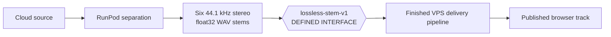

# Shizzle — Current Handoff

Last updated: 2026-08-05
Repository: `X:\GitHub\shizzle`

## Read this first

The RunPod-to-VPS interface is defined:

RunPod produces exactly the package in
[`../interfaces/lossless-stem-v1/spec.md`](../interfaces/lossless-stem-v1/spec.md). RunPod owns separation
through the six lossless float32 WAV files. The VPS owns everything after that
interface: the fixed delivery transformation, publication, CloudFront, and
browser playback.

## Finished production state

- Public application: `https://shizzle.systems`.
- Production library: exactly 27 accepted tracks.
- All 27 active immutable generations pass `shizzle-browser-v1`.
- All 189 active media objects were hashed, probed, keyframe-inspected, and
  completely decoded.
- All 162 browser stems are stereo AAC-LC and aligned within their tracks.
- Final production Chromium stress and bounded-fault runs pass 27/27.
- The Pot passes three consecutive natural plays, randomized seeking, mixing,
  fault recovery, natural end, and replay.
- Direct browser sensing and first-party telemetry observe media clocks,
  buffers, decoder state, Web Audio state, per-stem PCM, master PCM, limiter
  state, and recovery.
- The complete runtime and media path is cloud-hosted and consumed through one
  standards-based browser contract.

This is finished work. Future clean lossless stems use the same delivery
pipeline once. The existing library is revisited only if an actual production
issue is observed.

## Live architecture

- **VPS:** Hostinger `72.60.173.171`; production files at
  `/opt/shizzle/prod`; compose project name `shizzle`.
- **Application:** Caddy terminates HTTPS and serves the UI/API.
- **Control plane:** FastAPI, Postgres, and the durable orchestrator.
- **Media:** private S3 bucket `karaoke-pimpshizzle` through CloudFront
  distribution `ELKN8VGSX0M64` using expiring file-scoped URLs.
- **Playback:** six AAC Range streams plus one bounded, staged, revocable
  audio-less video Blob.
- **Rollback:** immutable generation predecessors and pointer-only activation;
  same-origin `/cdn` remains the tested delivery fallback.

## Active problem: source to lossless stems

New-song ingestion is not yet dependable end to end. Direct upload exists, but
the production orchestrator is not connected to a reliable cloud GPU execution
path and URL acquisition from the VPS is blocked by provider bot controls.

The next deliverable is:

> A URL or upload is acquired entirely in cloud infrastructure, processed by a
> cloud GPU into the exact `lossless-stem-v1` package, and handed to the
> unchanged finished VPS delivery pipeline.

The package contains `vocals.wav`, `drums.wav`, `bass.wav`, `guitar.wav`,
`piano.wav`, and `shizzle.wav`, plus `handoff.json`. Every stem is stereo,
44.1 kHz, IEEE float32 PCM, begins at sample zero, and has the same sample
count. There is no lossy audio and no per-stem normalization in this interface.
The sixth role is named `shizzle` at this interface; the worker rewrite renames
the separator's native `other` output to `shizzle` as it writes the package.

## RunPod state

- Endpoint: `tevdw8022hs8hn`.
- The live endpoint was last observed with one GPU per worker, allowed GPU pool
  RTX A5000/L4/RTX 3090/RTX A4000, and `workersMax=0`.
- With `workersMax=0`, no GPU can currently be allocated.
- Worker image: `ghcr.io/mdc159/shizzle-worker:v2`.
- A complete separation with real S3 input/output and both integrity gates was
  previously proven on an RTX 4070.
- `stemsplit/Dockerfile` does not bake `htdemucs_6s` weights. Cold workers must
  download them, which is the leading unresolved RunPod failure hypothesis.
- A healthy worker alone is not success. Require a golden job to reach
  `COMPLETED` and verify its S3 outputs.

## Next actions

1. Change the worker output to match `lossless-stem-v1`; remove AAC encoding,
   video derivation, and delivery-manifest ownership from the RunPod side.
2. Add the `htdemucs_6s` weight download to the worker image build.
3. Publish a new image through the `mdc159/shizzle-worker` GitHub Actions
   workflow.
4. Point the RunPod template to the new immutable tag.
5. Re-enable a small bounded worker pool.
6. Submit the golden fixture and require `COMPLETED` plus the exact lossless
   package in cloud storage.
7. If it fails, collect the actual cloud worker logs before changing code.
8. Connect the production orchestrator's dispatch, callback, polling,
   reconciliation, retry, and publication path.
9. Make URL acquisition cloud-reliable; keep upload as a first-class entry.
10. Feed `lossless-stem-v1` into the finished `shizzle-browser-v1` pipeline.

## Clean-library state

- Production database: 27 total tracks, 27 active tracks, zero jobs.
- Questionable orphaned source material was permanently removed from the
  versioned object store and never existed as a production track or job.
- The documentation-only record is
  [`library-source-purge-2026-08-05.md`](library-source-purge-2026-08-05.md).
- There is no recovery list, staged object, reserved identity, or special-case
  processing path. A future submission is ordinary new ingestion.

## Operational cautions

- Credentials are in the gitignored `.env` and production environment. Never
  print or commit them.
- Clear any ambient `AWS_ENDPOINT_URL` before real AWS operations; this machine
  may otherwise redirect AWS CLI traffic to another S3-compatible service.
- Always use `docker compose -p shizzle` because an ambient compose project
  variable may select another stack.
- Publish worker images through the dedicated GitHub Actions workflow.
- Browser automation is a headless cloud test consumer only.

## Primary documents

- [`../README.md`](../README.md) — simple project flow and current status.
- [`../interfaces/lossless-stem-v1/spec.md`](../interfaces/lossless-stem-v1/spec.md) — exact RunPod output
  and VPS input interface.
- [`architecture.md`](architecture.md)
  — current architecture.
- [`../interfaces/shizzle-browser-v1/spec.md`](../interfaces/shizzle-browser-v1/spec.md)
  — finished delivery profile.
- [`../evidence/cloud-continuous-playback/evidence.md`](../evidence/cloud-continuous-playback/evidence.md)
  — retained engineering evidence.
- [`playback-troubleshooting.md`](playback-troubleshooting.md) — symptom-driven
  diagnostics and the retained playback experiments.
- [`../evidence/cloud-continuous-playback/plan.md`](../evidence/cloud-continuous-playback/plan.md)
  — simple next implementation sequence.
- `evidence/spikes/` — troubleshooting experiments, not current requirements.
