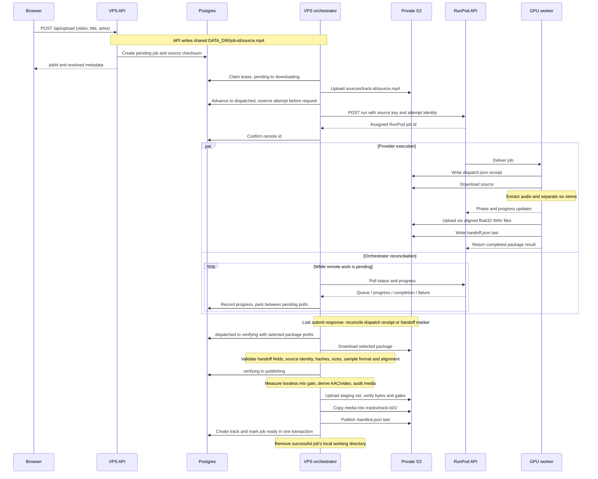
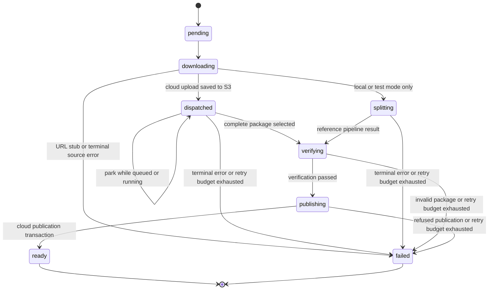
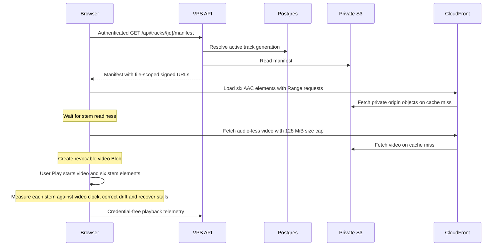
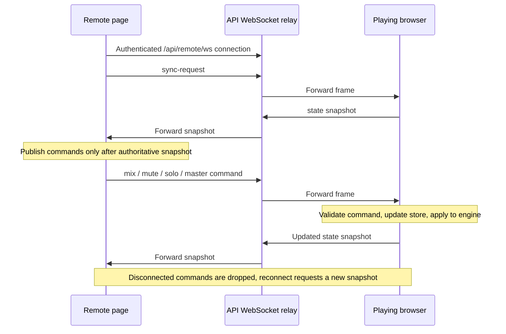

# Architecture

This describes the implemented cloud path. Operational readiness still depends
on the deployed configuration and provider availability; see [Setup](SETUP.md).
Known deviations and bugs are tracked in [Review](REVIEW.md).

## Components and ownership

| Component | Implementation | Responsibility |
|---|---|---|
| API | `library/src/shizzle_server/api/` | Uploads, passcode/token authentication, jobs, library, manifests with signed media URLs, telemetry, WebSocket relay |
| Durable state | `library/src/shizzle_server/db/` | Postgres jobs, stage/event ledger, leases, tracks, active-generation pointer, heartbeats |
| Orchestrator | `library/src/shizzle_server/orchestrator/` | Claims work, transfers sources, submits/polls RunPod, reconciles dispatch receipts, verifies and publishes |
| GPU worker | `stemsplit/lossless_handler.py`, `lossless_worker.py` | Downloads source, extracts audio, separates with htdemucs_6s, writes lossless package and progress |
| Delivery policy | `library/src/shizzle_server/publish/` | Verifies lossless bytes, derives AAC/video, measures common attenuation, audits, stages and promotes |
| Media storage | Private S3 | Sources, per-dispatch packages, staged and published generations |
| Edge delivery | CloudFront | Signed access to published objects, Range support, CORS |
| Browser | `player/src/` | Video-clock playback, six-stem mixing, health sensing, remote and dashboard pages |

The [README system diagram](../README.md#system-diagram) maps these boundaries.
`ingest/` is documentation, not a deployed process. The app origin is Caddy on
the VPS; CloudFront is the media origin. Same-origin `/cdn` proxy delivery is a
retained fallback, not the normal seven-object media path.

## Upload to publication



Sources: `api/routes.py`, `orchestrator/stages.py`, `orchestrator/cloud.py`,
`orchestrator/runpod_client.py`, `stemsplit/lossless_handler.py`,
`stemsplit/lossless_worker.py`, `publish/lossless_intake.py`,
`publish/publisher.py`, and `db/repository.py`.

The parallel lanes show polling during provider execution. Worker execution can
also start before submission confirmation reaches Postgres. Completion is detected by polling and
S3 reconciliation, not an inbound callback. The receipt can recover an accepted
job whose submission response or database confirmation was lost.

## Job state and recovery



The diagram shows successful and terminal transitions. Retryable errors schedule
another attempt at the same stage; pending-stage errors can also fail.
Parking releases a lease without charging an attempt. A failed remote worker can
be dispatched under a fresh reservation and package prefix. Unresolved dispatch
identity fails closed rather than silently creating duplicate GPU work.

Local and test modes retain reference/fault-injection behavior; their
`local/` output is refused by the canonical publication guard (C7). They are
not alternate supported production publication paths.

Postgres claims use `FOR UPDATE SKIP LOCKED`. Lease renewal runs during a stage.
Do not infer that every state-writing method is fully fenced by that fact:
the [review findings](REVIEW.md) cover stale-owner and liveness defects.

## Object layout and publication

```text
sources/<track-id>/source.mp4
tracks/<track-id>/1/separation/attempts/<sha256-idempotency-key>/
  dispatch.json
  handoff.json
  stems/{vocals,drums,bass,guitar,piano,shizzle}.wav
tracks/<track-id>/<generation>/
  manifest.json
  video.mp4
  stems/{vocals,drums,bass,guitar,piano,shizzle}.m4a
```

New ingestion uses generation 1 and a deterministic track UUID derived from the
job. Attempt packages are separate keys below the separation prefix and are
never referenced by the browser manifest. Staging prefixes hold inputs to
promotion; successful cloud publication removes local working files but retains
the S3 source, package, and staging objects. The manifest is the
published-generation completion marker.

Subsequent generation migration tools audit a candidate and use an atomic
compare-and-swap activation with an event ledger. Generation rollback changes
the active pointer; it does not overwrite accepted media. Application-release
rollback additionally restores the schema, image/configuration and UI through
[the deployment transaction](AUTOMATION.md).

## Playback and media grant



Six independent decoders feed per-stem gains, a master gain with fixed -3 dB
headroom, a DynamicsCompressor, and post-compressor measurement. Sharing one
AudioContext does not make their clocks identical. The engine measures each
stem separately. The video is the master timeline; AAC remains streamed, while
only one video Blob is retained and revoked on track change.

`window.__shizzlePlaybackHealth.getMetrics()` exposes read-only health,
per-stem skew/PCM, output PCM, limiter reduction and bounded incidents. The
mutating `window.__shizzle` engine/store hook exists only in development builds.
Mixer preferences persist; use Reset when a known mix is needed for comparison.
See [Testing](TESTING.md) for natural playback, repeated seeking, fault recovery,
end/replay and listening acceptance.

## Remote-control swim lanes



Sources: `api/remote.py` and `player/src/hooks/useRemoteSync.ts`.
The relay is in-process fan-out with no stored mix or room routing. Every
connected client shares it; the diagram shows one player and one remote.
The playing browser owns state. The remote page has no playback audio graph.
The deployment is single-user by design: one shared passcode, device tokens
that carry no user identity, and one deployment-wide relay room. Any
authenticated client can observe and control the playing browser, so the relay
must not serve more than one trusted user without adding session routing.

## Dashboard and operational checks

The shared `PipelinePanel` polls jobs and `/api/health` every five seconds while
active, shows stage columns and recent outcomes, and loads the selected job's
event timeline. Its duration baseline is currently a 40-second placeholder.
It does not measure RunPod pool capacity or source-duration-specific baselines.

Production uses separate API/orchestrator services, Postgres and Caddy.
Only the explicit release transaction migrates the production schema.
[Invariants](INVARIANTS.md) documents the contracts; [Review](REVIEW.md)
distinguishes their intended guarantees from reproduced implementation defects.
