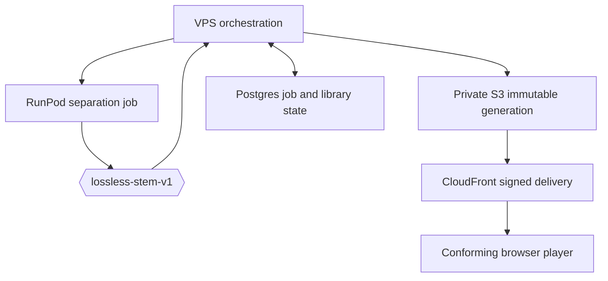

# Shizzle — Cloud Karaoke Stem Mixer: Current Design

Status: browser delivery and playback complete; cloud ingestion and fresh stem
separation are the active work.

## 1. Purpose

Shizzle accepts a song source, separates it into six stems, publishes a
browser-ready immutable track generation, and lets a standards-compliant browser
play and remix those stems in real time.

The runtime is 100% cloud-hosted and exposes one standards-based browser media
path.

## 2. The whole workflow and defined interface

`lossless-stem-v1` is both the required RunPod output and the VPS input. It is
exactly six aligned float32 WAV stems plus `handoff.json`. RunPod stops there.
The VPS starts there and applies the already-finished delivery transformation
without a song-specific alternate path.

The exact file layout and manifest are defined in
[`../interfaces/lossless-stem-v1/spec.md`](../interfaces/lossless-stem-v1/spec.md).

## 3. System architecture

- **VPS:** FastAPI control plane, authentication, Postgres, job orchestration,
  publication, and telemetry.
- **Cloud GPU:** source audio extraction and six-stem separation. RunPod is the
  current provider, but the job contract is provider-independent.
- **S3:** private staging and immutable published generations.
- **CloudFront:** direct signed media delivery with CORS and byte ranges.
- **Browser:** video master clock, six streamed stem decoders, Web Audio mixing,
  direct health instrumentation, and telemetry.

The VPS controls work but does not relay seven continuous media streams. Heavy
media work stays in cloud compute near object storage. Browsers consume the
published contract; they do not host or process server-side media.

## 4. Upstream ingestion — active work

Both supported entry paths converge on one cloud object:

1. A URL is acquired by a cloud-hosted downloader, or a user uploads a source.
2. The source is validated for size, duration, container, video, and audio.
3. The orchestrator submits an idempotent separation job to the cloud GPU.
4. The worker extracts audio and produces `lossless-stem-v1`: vocals, drums,
   bass, guitar, piano, and other as aligned 44.1 kHz stereo float32 WAV.
5. The worker uploads those six files and writes `handoff.json` last.
6. The VPS receives that exact package and runs the fixed delivery pipeline.

This is the next deliverable. The current RunPod endpoint must be made reliably
available, then proven with a small golden source that reaches `COMPLETED` and
produces verified cloud outputs. That work does not reopen browser delivery.

## 5. Finished delivery pipeline

Given `lossless-stem-v1` and the cloud source video, the fixed pipeline:

1. Encodes the six browser stems to the versioned `shizzle-browser-v1` profile.
2. Copies an already-compatible audio-less video or derives the bounded H.264
   delivery video.
3. Measures duration alignment, timestamps, decode completeness, checksums,
   sample safety, true peak, keyframe spacing, and required object roles.
4. Uploads and verifies media under a new immutable generation.
5. Writes `manifest.json` last.
6. Activates the generation with one database pointer change.
7. Exposes signed, file-scoped CloudFront URLs through the authenticated API.

The exact format, bitrate, FFmpeg commands, tolerances, and audit checks are in
[`../interfaces/shizzle-browser-v1/spec.md`](../interfaces/shizzle-browser-v1/spec.md).

## 6. Finished playback architecture

- Six independent stereo AAC-LC/M4A stem elements stream directly from
  CloudFront with byte-range support.
- The bounded audio-less H.264 video is fetched after stem readiness and played
  from one revocable Blob, making it a deterministic master clock.
- All stems feed one `AudioContext` through per-stem gains and a protected master
  bus.
- Play, pause, seek, end, replay, mute, solo, and fader changes are coordinated
  against the authoritative video timeline.
- A direct watchdog observes media clocks, buffers, errors, Web Audio state,
  every stem's rendered PCM, post-limiter PCM, limiter state, and recovery.
- First-party telemetry records actionable playback incidents without storing
  signed media credentials.

There is one browser contract. Support is capability-based, not tied to a
device, display, or browser-vendor-specific path.

## 7. Finished media profile

- RunPod handoff: exactly six stereo 44.1 kHz IEEE float32 WAV stems with one
  start sample and one sample count.
- New browser stems: stereo M4A/AAC-LC, one common sample rate per track,
  using a 44.1 kHz, 256 kb/s encoder target for every new lossless-derived
  encode. Actual AAC average bitrate varies with the audio.
- Complete browser generation: no more than 2.5 Mb/s average. The accepted
  27-track range is 1.473–2.331 Mb/s.
- Preserve already-passing aligned AAC rather than performing lossy
  up-transcoding.
- Apply only one common measured gain across all stems; never independently
  normalize them.
- Delivery video: audio-less MP4/H.264 Main 3.1, yuv420p, no more than
  1280×720/30 fps, zero-based timestamps, two-second closed GOP, and fast-start.
- Published layout: `tracks/<track-id>/<generation>/manifest.json`, `video.mp4`,
  and `stems/{vocals,drums,bass,guitar,piano,shizzle}.m4a`.

## 8. Publication and failure behavior

- Generations are immutable.
- Media is verified before the manifest exists.
- The manifest is the completion marker and is written last.
- The database points only to a completely verified generation.
- A failed candidate remains outside the library.
- Retrying the same job is idempotent and cannot create partial accepted state.
- Rejected or questionable material leaves no production-library row or
  processing reservation. A documentation-only historical note may exist
  outside the runtime.

## 9. Current proven state

- Production contains exactly 27 accepted tracks.
- All 27 active generations pass `shizzle-browser-v1` artifact audits.
- All 27 passed the final production Chromium stress and bounded-fault suites.
- The Pot passed repeated natural playback, randomized seeking, live mixing,
  recovery, natural end, and replay.
- Direct browser sensing and first-party telemetry identify a stopped or failed
  media path without relying on screenshots or external sensors.
- Media, services, publication, and playback are cloud-hosted.

This downstream portion is complete. Prior diagnostic runs remain useful as
targeted troubleshooting procedures but are not open requirements.

## 10. Next implementation sequence

1. Change the worker to emit `lossless-stem-v1` and stop at that interface.
2. Bake the `htdemucs_6s` model weights into the worker image.
3. Re-enable a bounded RunPod worker pool and verify a golden job reaches
   `COMPLETED` with the exact package in S3.
4. Connect the production orchestrator to submit, poll, reconcile, and receive
   completion callbacks.
5. Make URL acquisition cloud-reliable; retain direct upload as a first-class
   source path.
6. Pass the resulting package into the finished VPS delivery pipeline.

Optional interfaces such as remote controls may be built independently. They
do not alter or gate ingestion, delivery, or playback architecture.

## 11. Authoritative records

- [`README.md`](../README.md): simple current workflow and project status.
- [`HANDOFF.md`](HANDOFF.md): live operational state and immediate
  upstream work.
- [`../interfaces/lossless-stem-v1/spec.md`](../interfaces/lossless-stem-v1/spec.md): exact
  RunPod output and VPS input interface.
- [`../interfaces/shizzle-browser-v1/spec.md`](../interfaces/shizzle-browser-v1/spec.md):
  finished delivery contract.
- [`../evidence/cloud-continuous-playback/evidence.md`](../evidence/cloud-continuous-playback/evidence.md): retained
  measurements and failure-driven decisions.
- [`provenance.md`](provenance.md): source-code provenance.
- [`playback-troubleshooting.md`](playback-troubleshooting.md):
  symptom-driven diagnostics and experiment index.
- `evidence/spikes/`: troubleshooting experiments; informative, not current requirements.
