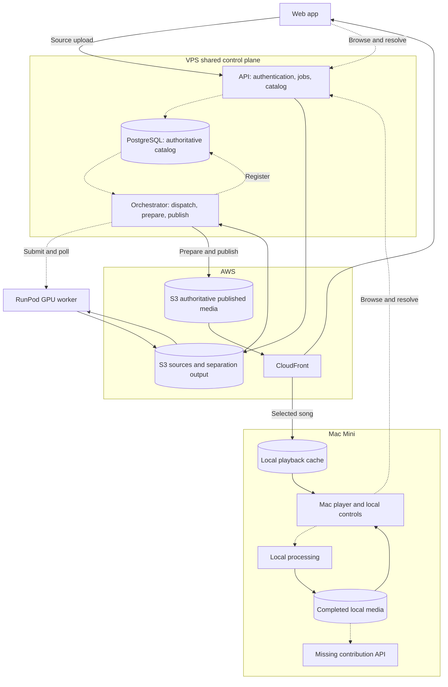
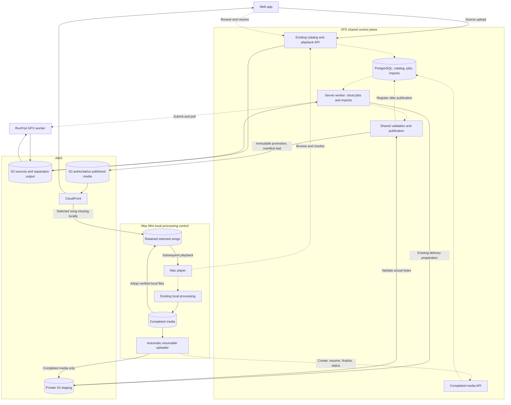

# One shared library for web and Mac

Both processing paths produce the existing finished-media specification. The
Mac contributes completed delivery media without another separation or encode.
The shared catalog decides which immutable generation both players receive.

## Physical storage and control

| Component | Location | Authority |
|---|---|---|
| Catalog, jobs, contribution records/events | PostgreSQL on the VPS, persistent Docker `pgdata` volume | Track identities, active generations and publication status |
| Published media and manifests | Private AWS S3, `tracks/<track-id>/<generation>/` | Finished media bytes |
| Media delivery | CloudFront, backed by private S3 | Expiring file access and edge cache |
| Mac imports | `~/Library/Application Support/Shizzle/imports/<id>/` | Durable local processing results and publication receipts |
| Saved Mac songs | `~/Library/Application Support/Shizzle/player/tracks/<track-id>/<generation>/` | Verified local copies, retained across restarts |
| Temporary processing | VPS `appdata`, RunPod worker disk, Mac import directory | Working files, not another catalog |

These locations describe the checked-in deployment configuration; they do not
prove that a deployment has been updated. The VPS API and orchestrator control
shared publication. The Mac controls local processing and its upload queue.
RunPod executes cloud separation jobs dispatched by the VPS.

Solid arrows below carry media; dashed arrows carry commands, status or catalog
information. The cloud's delivery preparation remains on the VPS.

## Current data flow before this change

## Proposed data flow implemented by this change

## Completed-media API

All operations require a valid existing Shizzle device token, configured
passcode authentication, and `SHIZZLE_COMPLETED_IMPORTS_ENABLED=true`. The flag
is **false by default** to permit server-first rollout. Browse-open mode never
permits contribution. Authorization uses the existing shared-passcode model;
this change does not introduce individual accounts or a new credential store.

| Operation | Request | Result |
|---|---|---|
| `POST /api/imports` | The existing delivery manifest JSON (at most 1 MiB) | Create/recover deterministic contribution |
| `POST /api/imports/{id}/uploads` | Empty body | Instructions for missing objects only |
| `POST /api/imports/{id}/finalize` | Empty body | Queue validation after all uploaded checksums/sizes match |
| `GET /api/imports/{id}` | No body | Durable status and canonical identity when ready |

Results contain `importId`, `status`, `errorCode`, `trackId`, and `generation`.
The latter two are populated only for `ready`. Upload instructions additionally
contain `uploads`: entries with `file`, `bytes`, `sha256`, `url`, and `headers`.
Send each file using PUT with exactly the returned headers. Instructions expire
after 15 minutes and never belong in logs or receipts. The Mac sends no Shizzle
token to S3. Authenticated manifests use the existing common profile and seven
canonical media files; source video and lossless separation output are not sent.

`401` means sign-in is required; `413`/`422` rejects the manifest; `409` on
finalize means incomplete upload (request instructions and resume); `503` means
unavailable/disabled support. The input manifest is bounded and checked before
any upload grant. Canonical manifest JSON, including its media checksums,
determines import identity. Identical resubmissions converge; changed manifests
are separate contributions, with no title-based merging or replacement.

Intake objects live under `imports/<import-id>/input/`, outside published
`tracks/` media access. Only checksum-bound writes are granted to clients. The
server downloads and hashes actual bytes, fully decodes media, checks the
existing delivery profile and inter-stem timeline, and measures the decoded
default mix with the existing output headroom. Server audit results are retained
on the import record separately from unchanged producer provenance.

A server-owned staging copy feeds the existing immutable publisher. Import-row
locking fences stale claims during promotion and catalog registration. The
manifest is written last; the catalog entry and ready event commit together.
A crash after S3 publication recovers against the matching manifest. Conflicting
or deleted tracks are not replaced/restored. No source acquisition, separation,
conversion, per-stem normalization, or package repair occurs in this path.

## Mac behavior

New local jobs opt into automatic publication. While the app is open, its queue
processes finished jobs independently of the separation lock; closing the import
dialog does not stop it. Closing the app leaves completed media and receipts;
pending publication resumes on the next launch. Device tokens remain in memory,
so a restarted app may need the existing Library sign-in before publishing.

`publication.json` records progress, retry timing and canonical IDs separately
from the local worker's `job.json`. Transient failures back off up to five minutes;
authentication waits for sign-in; rejected media is shown as needing attention.
Local playback stays available throughout. Historical imports are not swept into
the shared library. **Publish finished result** explicitly opts in one selected,
previously completed local job without processing it again.

Library browsing and refresh fetch metadata only. Selecting a song downloads its
missing media; complete copies persist across song changes, app exits and Mac
restarts. There is no automatic eviction, bulk library download or cache quota.

Media identity is checked independently of manifest metadata. When only title,
artist, gains or other manifest metadata changes, verified files are retained and
the local manifest is updated atomically. Subsequent compares then match. Expired
signed URLs never invalidate saved files. A corrupt/missing file alone is
re-downloaded; intact files are reused. A newer generation is saved alongside
the old generation. Failed downloads/insufficient space preserve existing songs.
A Mac's own published result is adopted from its verified local files without
fetching that media from CloudFront.

Both library drawers refresh on opening, explicitly, and every 30 seconds while
open (web polling also pauses in hidden browser documents). Refresh preserves
search, selection, playback and mixer state. Catalog title/artist override the
stored immutable manifest's descriptive metadata in playback responses.

## Rollout and acceptance

1. Run library, stemsplit, player and PostgreSQL contract checks; exercise the
   0006 migration downgrade/re-upgrade and native `--library-checks`.
2. Follow the repository PR convergence/review workflow and human-gated deployment
   in `AUTOMATION.md`. Deploy schema/API/worker before enabling contributions.
3. Verify the server IAM policy permits intake `imports/*` reads/writes as well
   as its existing publisher access; verify its FFmpeg tools and the deployed
   database revision. Do not broaden IAM or change authentication silently.
4. Enable `SHIZZLE_COMPLETED_IMPORTS_ENABLED=true` for both API and orchestrator
   through the controlled runtime deployment. This is an operational setting;
   changing the source default is not the rollout procedure.
5. Contribute only the retained Imperial March candidate. Confirm its canonical
   ID/generation in both apps and perform the prescribed `docs/TESTING.md`
   playback acceptance. Saved-copy replay must generate zero media downloads.

Local tests are not evidence of production registration, live browser playback,
listening, projector routing, or physical remote acceptance. Record these as
pending until actually performed. To disable new contributions, turn off the
flag in both services; existing library playback and saved Mac songs remain.
Before schema downgrade, stop/drain the import worker through the deployment
transaction. Uploaded media remains immutable and is not deleted by downgrade.

Implementation evidence: [2026-09-07 checkpoint](https://github.com/cbassist/m-shizzle/blob/codex/mac-youtube-ingest/evidence/spikes/mac-native-playback/SHARED-LIBRARY-RESULTS.md).

## Related upstream work

[Shizzle PR #47](https://github.com/mdc159/shizzle/pull/47) independently adds a
completed-package S3 drop-box importer and a VPS command. This contribution API
and durable automatic worker are a different interface to the same publication
need. The server proposal remains a draft until review reconciles identity,
validation, storage-prefix ownership and reuse with #47. Neither proposal should
be treated as the selected production interface merely because it passes tests.
