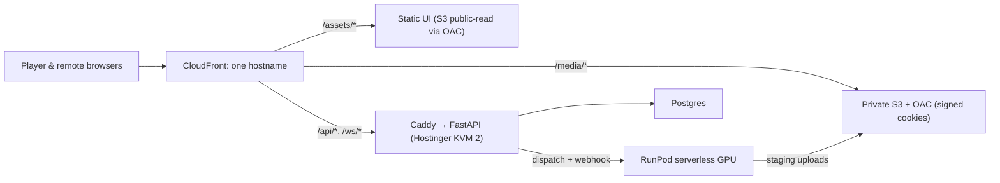

# Shizzle — Cloud Karaoke Stem Mixer: Design Spec

Date: 2026-08-02 (v2 — revised per review-01.md)
Status: Draft — pending Mike's review
Working name: "Shizzle" (agent's working default, taken from the repo directory and the `other`-stem alias; rename freely)

## 1. Purpose

A web app for Mike and a couple of musician friends. Paste a YouTube URL (or upload a video); the backend splits the audio into six stems (vocals, drums, bass, guitar, piano, shizzle/other) on a cloud GPU and stores everything on S3 behind CloudFront. Any browser plays the video with live per-stem faders. A phone or iPad can pair to a running player via QR code and become a pure touch mixing surface — the projector shows video, the iPad holds the faders.

Done means: from any location, paste a YouTube URL, and a few minutes later play that song on the projector while mixing stems live from an iPad, with sound quality and sync indistinguishable from the best local prototype.

**Non-goals:** commercial use, public multi-tenant service, per-user accounts/libraries, ABR bitrate ladders (deferred), offline mobile apps.

## 2. Prior art and salvage map

Three existing repos hold one lineage. Verdicts from the 2026-08-02 exploration + review:

| Source | Take |
|---|---|
| `k25-nextgen-rewrite` (committed, clean) | **Trunk.** `local-server/` + `ui/` codebase as starting point |
| `k25` working tree (branch `local`, uncommitted) | Mute/solo mixer, −60…+12 dB fader range |
| `k25/archive/runpod/` | **RunPod worker foundation** (`handler.py`, `s3_ops.py`, `manifest.py`, `audio_processing.py`, `callbacks.py`) — already does S3-in → extract → Demucs → mux → manifest → S3-out. Modernize, don't rewrite |
| `k25/archive/agent/` | `s3_multipart.py` (tested), `circuit_breaker.py` (tested), `pyproject.toml` (ruff + mypy strict — quality baseline) |
| `k25/archive/docs/aws/` | S3 naming spec, CloudFront docs |
| `docs/global-stem-playback-spec.md` (all repos) | Delivery blueprint: manifest v2, drift tiers, `AudioContext.currentTime` authority, CDN/CORS/Range requirements |
| Not carried | Git histories (3.5 GB committed media), n8n/Supabase-queue control plane, stale docs, dead env files, in-memory job dict, `MAX_JOBS` silent eviction, wide-open CORS, Windows-hardcoded paths |

New repo starts with fresh git history; good parts are copied, never merged. **Provenance ledger** (`docs/provenance.md`) records for each salvaged unit: source repo, commit (or "uncommitted working tree"), path, intentional changes, and relevant tests.

## 3. Architecture

**Single public hostname — everything same-origin through CloudFront** (removes the signed-cookie/CORS fragility class entirely; the salvaged player's `crossOrigin='anonymous'` never sends cookies cross-origin):

CloudFront passes WebSocket upgrades to the VPS origin. If split domains are ever reintroduced, media elements must switch to `crossorigin="use-credentials"` with exact-origin CORS + `Access-Control-Allow-Credentials` — avoid by staying same-origin.

**Component ownership:**

- **VPS control plane** (Docker Compose: `api`, `orchestrator`, `postgres`, `caddy`) — auth, API, yt-dlp ingest, job orchestration, artifact verification + publication, WebSocket relay. No heavy media work beyond optional source remux.
- **RunPod serverless worker** (modernized `archive/runpod/`) — everything media-heavy, where the files already are: audio extract, browser-safe H.264 video re-encode, Demucs (`htdemucs_6s --segment 7 --overlap 0.25 --shifts 0`; clip handling per §5 null-test contract), stem normalization (one common gain), PCM integrity measurement, AAC derivatives, decoded-AAC verification, `multi-track.mp4` mux, upload to **staging prefix**. Endpoint pinned to **1 worker / 1 concurrent job** (RunPod defaults to more).
- **Publisher** (VPS, final pipeline step) — verifies staged object sizes/checksums, writes the immutable manifest **last**, marks track ready.
- **S3 + CloudFront** — private bucket, OAC, signed cookies. **Immutable generations**: `tracks/{track_id}/{generation}/...`; never overwrite CDN-cached media in place. Lifecycle rules: expire staging inputs, failed attempts, and `AbortIncompleteMultipartUpload`.
- **Player** (browser) — streams video + six stems same-origin; Web Audio mixing; on-screen mixer drawer retained (mouse fallback).
- **Remote surface** — controls-only page: six touch faders + mute/solo, master fader, transport, library picker. No media rendering.

## 4. Ingest pipeline and job model

Entry paths (converge at "source video in S3 staging"): YouTube via yt-dlp on VPS (browser cookies; see Risks) or direct upload (existing chunked, size-capped streaming write + ffprobe gate).

Stages: `pending → downloading → dispatched → splitting → verifying → publishing → ready | failed`.

**Durable orchestration** (review item 4): persisting statuses is necessary but not sufficient — a dedicated `orchestrator` process (simple Postgres-backed loop; no Redis/Celery at this scale) owns job execution with restart-safety:

- `jobs` fields: id, source, status, `runpod_job_id`, `attempt`, idempotency key, worker lease + expiry, `next_retry_at`, processing-profile/model version, input/output checksums, structured error code (`YTDLP_BLOCKED`, `DEMUCS_FAILED`, `S3_UPLOAD_FAILED`, …), timings.
- Append-only `job_events` table for the full history.
- **RunPod completion webhook for responsiveness + polling reconciler for recovery** (RunPod retries webhooks only twice and retains async results ~30 min — polling alone cannot recover from a long outage).
- Circuit breaker (salvaged) wraps RunPod calls.

`tracks`: id, title, duration, S3 prefix + generation, manifest key, integrity results (§5), created. No silent retention deletion; manual delete in UI.

## 5. Playback, delivery, and sound quality

Quality bar (Mike, 2026-08-02): "It's got to sound good. No matter what, at the end of the day, it is music."

**Playback clock — honest model (review item 1):** six `HTMLAudioElement`s share one `AudioContext` mixing graph but **not** a decoder, buffer state, or media timeline. Stems are *actively synchronized*, not inherently synchronized. Therefore:

- A **`PlaybackEngine` interface** from day one, with two planned implementations:
  1. **Media-element engine** (first): salvaged six-element approach + tiered drift policy (<50 ms ignore; 50–250 ms `playbackRate` nudge ±0.5%; >250 ms single hard seek; stall detection, 3-tick bailout). Instrumented to measure per-stem skew (never only the average), per-stem buffer/stalled state, mix-to-video drift, hard-correction and underrun counts.
  2. **Aligned segment scheduler** (fallback, only if devices can't hold skew): decode and schedule all six stems against `AudioContext.currentTime` per the global playback spec.
- **Phase-0 spike decides**: full-song runs on projector browser and iPad with skew instrumentation, before any cloud build.

**Audio graph:** per-stem gain (mute/solo, −60…+12 dB) → **master gain bus** → **transparent conservative limiter** → destination. Default headroom on the master; clip indicator in the UI (six stems at +12 dB can clip badly). `default_gain` renamed **`default_gain_db`** everywhere — unit-bearing name prevents the dB/linear bug returning. `setTargetAtTime` 50 ms smoothing retained.

**Format:** AAC `.m4a` per stem; bitrate is a config knob with the default chosen by **blinded listening comparison** on representative tracks (candidate 256k vs 320k; "source is ~130k so 320k is transparent" is not sufficient reasoning once six independent encodes are summed). ALAC is a capability-gated separate rendition option, not an assumed same-path swap.

**Streaming, not preloading:** modest `preload`, CloudFront Range requests, rolling buffer (few MB constant), full teardown on track switch. Kills the historic RAM blowup and one-song limit.

**Integrity gates (review item 5) — pipeline-integrity checks, not separation-quality scores:**

- Demucs output preserved in float (or input attenuated below clipping); **never** per-stem independent normalization — `--clip-mode rescale` can alter relative stem levels and poison a unity-sum test. One common post-separation gain, recorded in the manifest.
- Two recorded checks: (a) PCM reconstruction residual before delivery encoding; (b) decoded-delivery residual after AAC encode/decode. Stored per track: sample count, offset, RMS residual, peak residual, threshold/profile version.
- Cannot measure vocal bleed or model separation quality — Demucs ceiling is a known, separate limitation.

**`multi-track.mp4`:** kept (Mike's archival format from the proven first prototype; one existing config flag on the worker + storage pennies). Reviewer proposed deferral — overridden pending Mike's confirmation.

## 6. Pairing protocol (remote surface)

- Player registers session over WebSocket → short-lived session code → QR (`/remote/{code}`). Multiple remotes allowed.
- **Message envelope** (review): `version`, `clientId`, `commandId`, server-assigned `revision` on state broadcasts. Payloads: `{gain_db, stem}`, `{mute|solo, stem}`, `{transport}`, `{loadTrack}` — intents only.
- **Player is single source of truth**: applies intents, broadcasts authoritative state; snapshots on connect/reconnect; out-of-order commands resolved by revision.
- Fader traffic coalesced to ~20–30 updates/s per control.
- Latency budget: WebSocket round trip (tens of ms) — accepted for sliders/transport.
- Sessions die with the player; codes expire.

## 7. Auth, security, cost

- **Auth:** one shared passcode → hashed opaque device tokens with expiration and revocation, plus an auth-version field checked per request — **passcode rotation revokes all existing tokens**. Token gates API + WebSocket and sets CloudFront signed cookies for `/media/*`.
- **QR credential:** high-entropy, short-lived, session-scoped; exchangeable for a WebSocket-only credential — never general library access.
- **Hygiene:** same-origin topology (no CORS surface in normal operation); HTTPS via Caddy + Let's Encrypt at the VPS origin; yt-dlp input validated to YouTube domains; rate limit on passcode endpoint; path-traversal guards carried over.
- **Cost (~20 songs + few sessions/mo):** VPS ~$9 (Hostinger KVM 2), RunPod ~$1–2 (now includes encode time), S3 ~$1/100 songs, CloudFront $1–5 → **~$12–20/mo**, nothing scales with idle.

## 8. Testing

Philosophy: **real at boundaries, deterministic in the core** (refined per review; consistent with Mike's fault-injection-only-where-reality-can't-be-provoked preference).

- Live smoke tests at real boundaries: ffmpeg, browser, AWS, RunPod.
- Deterministic unit tests for pure logic: manifest generation, drift-policy math, session revision/state machine, orchestrator transitions.
- Contract + fault-injection tests for what reality can't reliably provoke on demand: duplicate webhooks, orchestrator restarts mid-job, partial uploads, timeouts, out-of-order remote commands.
- Integration: real ffmpeg on a bundled fixture clip; Playwright e2e on the same fixture (no personal-path fixtures).
- Every processed song exercises both integrity gates.
- Device acceptance matrix (not "any browser"): **known Chromium device over HDMI = reliable renderer**; projector Tizen browser = opportunistic, tested in phase 0; iPad Safari = supported control + playback target.

## 9. Build order (revised per review — risk spikes first)

0. **Risk spikes** (cheap, before structural work): projector/iPad full-song playback with stem-skew instrumentation; signed-cookie media proof through CloudFront; Demucs clip-mode/gain null-behavior check; blinded AAC bitrate comparison.
1. **Repo assembly** — fresh repo, salvage in, provenance ledger, schemas, strict tooling (ruff/mypy from archive; ESLint + knip enforced). Gate: local golden-track pipeline runs on the 4070.
2. **Job model + orchestrator** — Postgres schema, durable orchestrator process, restart/retry tests pass.
3. **S3 staging/publish contract + RunPod worker** end-to-end. Gate: YouTube URL → staged, verified, published track.
4. **Same-origin CloudFront distribution** + authenticated full-song playback from CDN.
5. **Playback hardening** — master bus + limiter, PlaybackEngine instrumentation on the device matrix. Gate: full song, zero audible artifacts, drift within thresholds, on all matrix devices.
6. **Remote surface** — revisioned protocol, QR pairing. Gate: two-controller party test.
7. **Operations + polish** — backups, lifecycle rules, health checks, metrics, cost check; YouTube search (Data API), job history page, library management.

## 10. Risks and open decisions

**Risks**
- **yt-dlp from datacenter IP**: cookies may not suffice. Fallbacks in order: cookie auth → home-helper downloader → manual upload (works day one). Resolve empirically in phase 3.
- **Projector (Tizen) browser**: unknown Web Audio fitness — phase-0 spike; Chromium-over-HDMI is the guaranteed path.
- **Media-element sync ceiling**: if phase-0 skew measurements fail thresholds on real devices, the segment-scheduler engine becomes phase 5 work (interface already in place).
- **Demucs quality ceiling**: stem bleed is model-inherent; integrity gates detect pipeline faults only.

**Open decisions**
- VPS: fresh Hostinger KVM 2 (2 vCPU / 8 GB / 100 GB NVMe), US region — Mike confirmed intent 2026-08-02; final plan/region at purchase.
- `multi-track.mp4`: kept in design (agent's call, contra reviewer) — Mike to confirm or defer.
- App name/domain: "Shizzle" is a working default.
- Old infrastructure audit: bucket `karaoke-pimpshizzle` (named in archived handler) and any surviving RunPod endpoint — check before creating new resources.

**Credentials checklist (needed from phase 0/3)**
- Fresh AWS keys (current CLI creds dead — verified 2026-08-02). Scope: S3, CloudFront, IAM for OAC.
- RunPod API key; dashboard check for surviving endpoint.
- VPS root/SSH once spun up.
- YouTube: exported browser cookies; Data API key (search/metadata only — cannot download).
