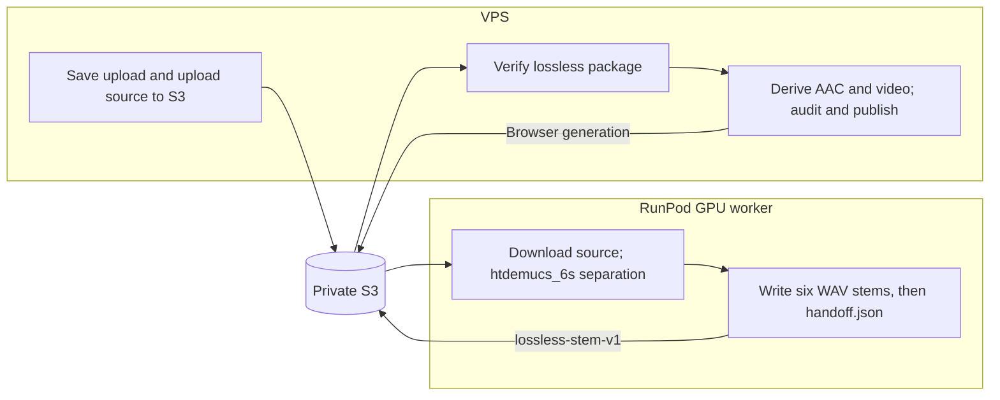

# RunPod to VPS lossless-stem interface

Interface identifier: `lossless-stem-v1`.
Machine-readable contract: [schema.json](schema.json); complete example:
[example.json](example.json).

## Responsibility boundary



The GPU worker owns source extraction and lossless separation. It does not
choose browser codecs, encode AAC/video, set playback gains, or publish the
browser manifest. The VPS owns those delivery operations.
Upload is supported; URL acquisition is still a stub.

## Package location and completion

New cloud dispatches write an isolated attempt:

```text
tracks/<track-id>/<generation>/separation/attempts/<sha256(idempotency-key)>/
  dispatch.json
  handoff.json
  stems/
    vocals.wav
    drums.wav
    bass.wav
    guitar.wav
    piano.wav
    shizzle.wav
```

The package prefix comes from the dispatch identity. The worker first writes
`dispatch.json`, binding the platform job ID, track, generation, idempotency key
and package prefix. The orchestrator can use it to reconcile a lost submission
response. This receipt is bookkeeping, not proof that separation completed.

All six WAV objects must be uploaded before `handoff.json`. That final marker
defines a complete package. The sixth role is `shizzle`; the worker maps the
separator's native `other` role when writing the files. Existing in-flight jobs
without an attempt identity have a compatibility lookup at the base separation
prefix; it is not the new-dispatch layout.

### Replay guard (worker-side, 2026-09)

Each attempt prefix is single-owner. The worker claims it with a conditional
receipt write (`dispatch.json` PUT with `If-None-Match: *`, carrying
`claimed_at`, `heartbeat_at`, and a per-invocation `execution_id`); once
`handoff.json` is visible the worker treats the attempt as complete, returns
the stored completion metadata, and performs no writes at all. Ownership is
proven before every package write by a conditional receipt heartbeat
(`If-Match` refresh of `heartbeat_at`: after download, after separation,
before each stem upload, and before the handoff), and a claim is reclaimable
only once its `heartbeat_at` is older than `SHIZZLE_DISPATCH_STALE_SECONDS`
(default 900 s) — a live worker that heartbeats per stem is never reclaimed
under, and a displaced predecessor fails its next proof before any PUT.
An invocation that does not own the claim never reports completion — the
handler raises and the RunPod job fails, so the orchestrator retries the
dispatch under a fresh idempotency key (invariant B12). After the conditional
`handoff.json` write the handler re-verifies the published package (stem
ETags against recorded upload ETags, handoff bytes by sha256) and fails the
job on any mismatch. On stores without conditional-write support,
`SHIZZLE_CONDITIONAL_DISPATCH=0` falls back to an unconditional receipt
write and the guard degrades to the completion check alone. A completed
package therefore cannot be mutated or torn by a redelivered or racing
worker.

## Required audio

| Property | Required value |
|---|---|
| Container | WAV |
| Representation | IEEE float32 PCM (`pcm_f32le`) |
| Sample rate | 44,100 Hz |
| Channels | 2, stereo |
| Start | Sample zero |
| Length | Same sample count for all six stems |
| Relative levels | Exact separator output; no per-stem normalization |
| Lossy encoding or integer clipping | None |

Each stem represents 2,822,400 b/s of uncompressed PCM before headers; the six
stems total 16,934,400 b/s. This is a processing handoff, not browser delivery.

## Handoff identity and validation

`handoff.json` records the interface, UUID track identity, generation, source
object key and SHA-256, separator/model version, immutable worker image,
sample rate/channel/format/start/count, and each stem's role, path, byte count
and SHA-256. Use the complete [example](example.json) and schema for exact keys;
do not invent partial manifests as test packages.

The VPS downloads the selected package and independently checks schema,
path containment, actual byte sizes and hashes, WAV format, and sample
alignment. Cloud intake also checks the source object key and submitted source
checksum. Missing handoff is retryable; invalid package content is rejected.
See `library/src/shizzle_server/publish/lossless_intake.py` and
`library/src/shizzle_server/orchestrator/cloud.py`.

## Downstream delivery

The VPS uses the [browser delivery contract](../shizzle-browser-v1/spec.md):
six AAC-LC/M4A stems at a 256 kb/s new-encode target, bounded audio-less H.264
video, a measured common attenuation recorded as playback defaults, artifact
checks, manifest-last immutable publication and database activation.
The complete browser generation must average at most 2.5 Mb/s.

Worker creation, baked model weights, endpoint configuration and a golden cloud
job are covered in [RunPod setup](../../deploy/runpod/README.md).
[Testing](../../docs/TESTING.md) retains stem optimization, codec/listening,
scrubbing, fault recovery and end/replay procedures. Prior measured results
remain under `evidence/`; they do not define current endpoint health.
