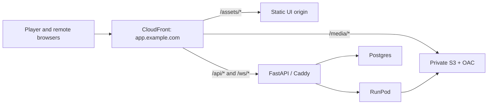

Overall verdict: the direction is strong and appropriately scoped for a private application. I would approve it as an architectural draft, but not begin the main implementation until five issues are resolved. The largest risks are playback synchronization, signed-cookie delivery, pipeline ownership, durable job recovery, and the Demucs/null-test interaction.

## Critical changes

1. Fix the playback-clock model

The spec says the muted video is authoritative and that inter-stem drift is impossible because all stems share one `AudioContext` ([spec, line 82](<X:\GitHub\shizzle\docs\superpowers\specs\2026-08-02-shizzle-cloud-karaoke-design.md:82>)). That is not true with six `HTMLAudioElement`s.

The existing player creates six independent elements ([audio.ts, line 27](<X:\GitHub\k25-nextgen-rewrite\ui\src\lib\audio.ts:27>)). Connecting them to one `AudioContext` gives them a common mixing graph, but not a common decoder, buffering state, or media timeline. Worse, the current drift logic averages their times ([audio.ts, line 78](<X:\GitHub\k25-nextgen-rewrite\ui\src\lib\audio.ts:78>)), which can hide one stem being early while another is late.

The design also contradicts the earlier playback spec, which makes `AudioContext.currentTime` authoritative ([global playback spec, line 113](<X:\GitHub\k25-nextgen-rewrite\docs\global-stem-playback-spec.md:113>)).

Recommendation:

- Add a `PlaybackEngine` interface now.
- First implement the simpler six-media-element engine, but measure:
  - maximum stem-to-stem skew;
  - each stem’s buffer and stalled state;
  - mix-to-video drift;
  - hard corrections and underruns.
- Never use average stem time as the only measurement.
- Run a full-song projector/iPad spike before building the cloud pipeline.
- If real devices cannot hold the required skew, implement an aligned segment scheduler that decodes and schedules all six stems against `AudioContext.currentTime`.

Until such a scheduler exists, describe the video as master and the stems as actively synchronized—not inherently synchronized.

2. Make media and the application same-origin

CloudFront signed cookies conflict with the salvaged player’s `crossOrigin = "anonymous"` setting ([audio.ts, line 29](<X:\GitHub\k25-nextgen-rewrite\ui\src\lib\audio.ts:29>)). Cross-origin anonymous media requests do not include cookies; `use-credentials` does. [MDN documents the credential behavior](https://developer.mozilla.org/en-US/docs/Web/API/HTMLMediaElement/crossOrigin), while CloudFront requires the browser to return all three signed-cookie values before it serves protected media. [AWS signed-cookie documentation](https://docs.aws.amazon.com/AmazonCloudFront/latest/DeveloperGuide/private-content-signed-cookies.html).

My preferred topology is one public CloudFront hostname:

CloudFront supports WebSockets to custom origins when the required upgrade headers are forwarded. [AWS WebSocket guidance](https://docs.aws.amazon.com/AmazonCloudFront/latest/DeveloperGuide/distribution-working-with.websockets.html).

This makes media, authentication responses, and the player same-origin and removes most CORS/cookie fragility. If separate domains are retained, use `crossorigin="use-credentials"`, an exact allowed origin, and `Access-Control-Allow-Credentials: true`.

3. Keep heavy media processing where the files are produced

The current flow uploads the input WAV, has RunPod upload six large WAV stems, and then requires the VPS to download them again to encode AAC and build the MP4 ([spec, lines 64–66](<X:\GitHub\shizzle\docs\superpowers\specs\2026-08-02-shizzle-cloud-karaoke-design.md:64>)). That produces unnecessary transfers and turns the 2-vCPU VPS into a media worker.

Recommended ownership:

- VPS:
  - authentication and API;
  - yt-dlp ingest;
  - conditional video remux/re-encode;
  - job orchestration;
  - final artifact verification and publication.
- RunPod:
  - Demucs;
  - stem normalization;
  - PCM integrity measurements;
  - AAC derivatives;
  - decoded-AAC verification;
  - direct upload to a staging prefix.
- Publisher:
  - verifies object size/checksum;
  - writes the immutable manifest last;
  - marks the track ready.

The archived RunPod handler already performs extraction, Demucs, packaging, and S3 upload, so it is a better salvage foundation than a completely thin wrapper ([handler.py, line 79](<X:\GitHub\k25\archive\runpod\handler.py:79>)).

I would defer `multi-track.mp4` until it has a defined consumer. It adds processing and storage but is neither a lossless archive nor the live-mixing format.

4. Add a durable orchestrator, not just persistent statuses

Persisting every transition is necessary but does not make background execution restart-safe.

Use four Compose processes: `api`, `orchestrator`, `postgres`, and `caddy`. The orchestrator can remain a simple Postgres-backed loop—Redis/Celery is unnecessary initially—but jobs need:

- `runpod_job_id`;
- `attempt`;
- idempotency key;
- worker lease and lease expiration;
- `next_retry_at`;
- processing-profile/model version;
- input and output checksums;
- structured failure details;
- append-only `job_events`.

Claiming that RunPod serializes work is only valid if the endpoint is explicitly configured with one worker and one concurrent job; current endpoints default to multiple maximum workers. [RunPod endpoint settings](https://docs.runpod.io/serverless/endpoints/endpoint-configurations).

Use a completion webhook for responsiveness plus a polling reconciler for recovery. RunPod currently retries a failing webhook only twice and retains asynchronous results for 30 minutes, so polling cannot be the only state recovery mechanism after a long outage. [RunPod request documentation](https://docs.runpod.io/serverless/endpoints/send-requests).

5. Rework the null-test contract

The chosen `--clip-mode rescale` can independently rescale outputs and therefore alter relative stem levels. Demucs explicitly warns that this can break the relative volume between stems. [Demucs documentation](https://github.com/facebookresearch/demucs).

That conflicts directly with summing stems at unity and treating the residual as a reconstruction gate.

I recommend:

- Preserve floating-point Demucs output or attenuate the input enough to avoid clipping.
- Apply one common post-separation gain to all stems, never independent normalization.
- Record two separate checks:
  - PCM reconstruction integrity before delivery encoding;
  - decoded-delivery integrity after AAC has been encoded and decoded.
- Store sample count, offset, RMS residual, peak residual, and threshold/profile version.
- Treat this as a pipeline-integrity test only. It cannot measure vocal bleed or separation quality.

## Additional recommendations

- Add mix-bus protection. Six stems at +12 dB can clip badly. Use default headroom, a master meter/clip indicator, and a conservative transparent limiter.
- Replace `default_gain` with `default_gain_db` everywhere. Unit-bearing names prevent the bug from returning.
- Choose AAC bitrate through a blinded comparison on representative tracks. “YouTube is ~130k, therefore 320k is transparent” is not sufficient because six independently encoded stems are summed later. ALAC should be a separate capability-gated rendition, not assumed to use an identical browser path.
- Move the Tizen experiment to phase 0. “Any browser” should become a tested support matrix. I would make a known Chromium laptop/mini-PC over HDMI the reliable renderer and treat smart-projector browsers as opportunistic.
- Add protocol envelopes to WebSocket messages: `version`, `clientId`, `commandId`, and server-assigned `revision`. Coalesce fader traffic to roughly 20–30 updates per second and send authoritative snapshots on reconnect.
- Passcode rotation must revoke existing device tokens. Use hashed opaque tokens with expiration/revocation, or include an authentication-version field checked on every request.
- QR credentials should be high-entropy, short-lived, session-scoped, and exchangeable for a WebSocket-only credential—not general library access.
- Use immutable artifact generations such as `tracks/{track_id}/{generation}/...`; never overwrite CDN-cached media in place.
- Add lifecycle rules for staging inputs, failed attempts, and abandoned multipart uploads. AWS specifically recommends `AbortIncompleteMultipartUpload` lifecycle handling. [AWS guidance](https://docs.aws.amazon.com/AmazonS3/latest/userguide/mpu-abort-incomplete-mpu-lifecycle-config.html).
- Refine “real over mocked” to “real at boundaries, deterministic in the core.” Keep live ffmpeg, browser, AWS, and RunPod smoke tests, but also use contract tests and fault injection for duplicate callbacks, restarts, partial uploads, timeouts, and out-of-order remote commands.
- Preserve provenance despite the fresh history: record source repository, commit, copied path, intentional changes, and relevant tests in `docs/provenance.md`.

## Recommended build order

1. Risk spikes: projector playback, stem skew instrumentation, signed-cookie media proof, Demucs gain/null behavior, and AAC listening comparison.
2. Fresh repository assembly, provenance ledger, schemas, and local golden-track pipeline.
3. Postgres job model plus separate durable orchestrator and restart/retry tests.
4. S3 staging/publish contract and RunPod end-to-end worker.
5. Same-origin CloudFront distribution and authenticated full-song playback.
6. Mix-bus hardening and the real-device acceptance matrix.
7. Revisioned remote-control protocol and two-controller party test.
8. Operations: backups, lifecycle rules, health checks, metrics, and cost measurement.

With those changes, this becomes a very sensible architecture: a modular monolith for control, one disposable GPU worker, immutable object storage, a CDN, and a thin synchronized remote. The design philosophy is good; the main adjustment is to prove the hard media and browser assumptions before building the surrounding cloud machinery. No files were changed.